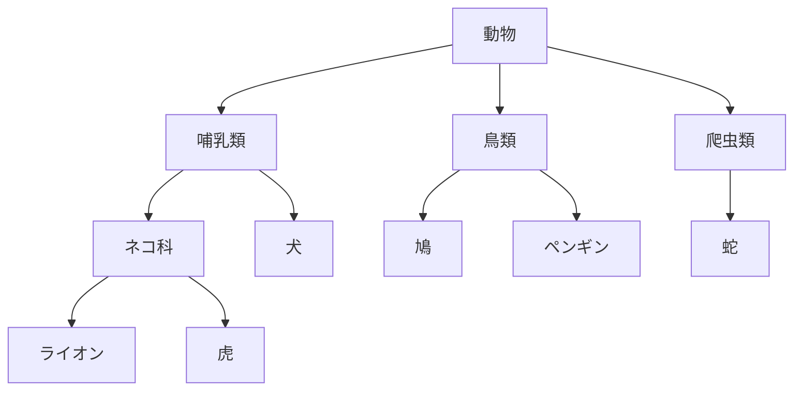
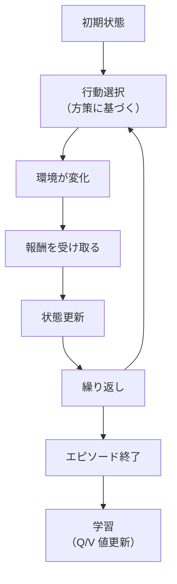

## はじめに
:::message alert
記事内容は筆者の勉強まとめ内容です。内容の正確さや漏れについては保証できません。
ご覧いただく際は、ご自身で判断のうえ参考にしてください。
:::

## 概要
- シラバス：E資格2024#2
- 機械学習の分類を知ります

## キーワード
教師あり学習, 半教師あり学習, 教師なし学習, 強化学習, 
次元削減

## 学習内容

### 教師あり学習(supervised learning)
- 正解となる答えが含まれたデータをモデルに学習される方法です
    - 正解となる答えを**ラベル**といいます
    - 答えが含まれたデータを**ラベル付きデータ**、もしくは**訓練データ**と呼びます
- **分類**と**回帰**2タイプに分けられます
- 目標：学習により、誤差が小さくなって、最終的にラベルがないデータ（テストデータ）を正解することです

#### 分類
- データをできるだけ分けるようにします
- 答えがカテゴリになっていることが特徴です
- カテゴリとは
    - 連続した数値ではない（離散値）
    - 大小や順序に意味がない
    - 例：犬/猫/兎、スパムメール/スパムメールではない、小学生/中学生/大学生
- よく使われるアルゴリズム：ニューラルネットワーク、SVM,ロジスティック回帰、決定木など

#### 回帰
- 様々な関連性のあるデータから未来を予測する学習方法です
- データと答えが連続した数値（連続値）が特徴です
- よく使われるアルゴリズム：ニューラルネットワーク、SVR、・ランダムフォレスト、ベイズ線形回帰分析など

### 半教師あり学習（Semi-Supervised Learning）
- 「少量のラベル付きデータ」と「大量のラベルなしデータ」を組み合わせて学習する手法です
- メリット
    - 少ないラベルで高性能モデルが作れます
    - ラベル付けの手間が減ります
- 課題
    - 擬似ラベルが間違っていると誤学習を広げる可能性があります
    - 実装が複雑になりがちです

:::message
**擬似ラベル**
ラベルのついていないデータに対して、モデルが自動で仮のラベル（予測）を与えたものです
:::

### 教師なし学習（Unsupervised Learning）
- 未知の集合を、いくつかの集まりに分類させる学習方法です
- 教師なし学習でできること：クラスタリング、次元削減、異常検知
- 目標：正解を与えずに、データの特徴を自動的に見つけ出します

#### クラスタリング（Clustering）
- 似たようなデータ同士をグループに分けます
- 階層的クラスタリング
    - データを**ツリー構造（階層）**でクラスタに分類
    - 最終的に**デンドログラム（樹形図）**として表現される
    - クラスタ数を事前に指定する必要がない（あとからカットして調整できる）
    - 一度統合・分割したら戻れない
    - 構造の発見を向いています

 - 非階層的クラスタリング
     - あらかじめクラスタ数を指定して分割
     - クラスタの再計算が可能
     - 効率的な分割を向いています

:::details 階層的クラスタリングの例
> データ：ライオン、虎、犬、鳩、ペンギン、蛇

- ライオンと虎 → 「ネコ科」クラスタに
- その後犬が加わって「哺乳類」クラスタに
- 鳩とペンギン → 「鳥類」クラスタに
- 蛇 → 「爬虫類」クラスタに
- 最終的に、すべてを「動物」クラスタにまとめる

※画像が表示されない場合はリロードしてください

:::

:::details 階層的クラスタリングの例
> とあるECサイトで以下のような顧客データがあります：年齢、月あたりの購買金額、購入頻度

この特徴量を使って、３つのクラスタを分けます
- クラスタA：高額・高頻度のリピーター
- クラスタB：低額・低頻度のライトユーザー
- クラスタC：中程度の利用頻度の平均的ユーザー

:::

#### 次元削減（Dimensionality Reduction）
- データから重要な情報を抜き出し、重要ではない情報を削減することです
- 次元：データを表す軸や特徴量の数
    - 顧客データ：年齢、性別、購買履歴、サイト訪問頻度、地域 → 5次元
    - 画像：28×28ピクセル → 784次元
- 目的：
    - ノイズ除去・過学習防止：重要でない特徴を削除し、モデルをシンプルにできます
    - 計算コストの削減：特徴量が少なければ、学習や推論が高速になります
    - データの構造が見えやすくなる：クラスタやパターンを発見しやすくなります
- 応用例：
    - 画像認識：分類前処理・特徴抽出
    - 顧客分析：類似顧客のグループ化
    - 遺伝子解析：関連遺伝子の発見・可視化

:::details PNG→JPGの画像圧縮は次元削減か
**違います**
PNG→JPGのことはデータ圧縮であって、機械学習やデータ分析の文脈で使われる次元削減とは異なる概念です

- 共通点：情報の圧縮をします
- 異なる点

| 項目 | 次元削減 | 画像圧縮 |
| ---- | ---- | ---- |
| 本質 | 情報の構造の理解と保持 | 視覚的品質の保持と軽量化 |
| 主な目的 | 特徴抽出・データ構造の理解 | ファイルサイズを小さくし、通信・保存効率化 |
| 対象 | 多次元の数値データ | 主に画像データ（ピクセル値） |
| 次元の扱い | 「軸の数（特徴量）」を減らす | 「ビット数やデータ量」を減らす |
| 情報の復元 | 一部の次元を捨てるため構造が維持されること重視（情報重視） | 見た目を維持できれば一部情報の欠落は許容（見た目重視） |
| 再学習・分析向き | 分類・クラスタリングなどMLの前処理に使える | モデル学習には基本使わない（あくまで表示目的） |
| 機械学習との相性 | 非常に高い | 原則として低い |
| 主な用途 | 機械学習・統計分析・可視化 | ストレージ・ウェブ表示 |

:::

#### 異常検知（Anomaly Detection）
- 多くの正常データと異なる振る舞いをするデータを見つけます
    - 異常データのバリエーションは多岐にわたることが多いため、正常な行為がどのようなものかを学習し、それと大きく異なるものを識別することができます
- 例：クレジットカードの不正利用検出、ネットワークセキュリティの侵入検知

:::message 
**異常検知について**
異常検知でよく使われる手法

- 統計的手法（例：平均と標準偏差を用いた異常検出）
- 機械学習手法
    - 教師あり学習（異常なデータにラベル付けされている場合）
    - 教師なし学習（ラベルなしデータを用いる）
    - 半教師あり学習（一部にラベルがあるデータ）
- 深層学習
    - オートエンコーダー：入力データを圧縮し、再構成する過程で異常を見つける
    - 自己回帰モデル（ARIMA）：時系列データで異常を検出

:::

### 強化学習（Reinforcement Learning）
- 試行錯誤を繰り返しながら最適な行動をするように学習する方法です
- 目標：長期的な報酬の期待値を最大化することを目指します

- 要素
    - エージェント(Agent)：学習し行動を選択する主体
    - 環境(Environment)：エージェントが動作する世界や状況
    - 状態(State)：現在の環境の情報。観測値
    - 方策(Policy)：状態に対してどの行動を選ぶかのルール
    - 行動(Action)：状態に基づきエージェントが選択する操作
    - 報酬(Reward)：行動の良し悪しを数値で評価
    - エピソード(Episode)：開始から終了までの1サイクルの経験
    - 収益(Return)：	エピソード全体で得られる報酬の合計
    - Q値(Q-Value)：状態sで行動aを取ったときに得られる期待報酬
    - V値(V-Value)：	状態sにおける最大のQ値（最適行動を取ったときの期待報酬）

- 要素をまとめ

| 項目    | 本質                 |
| ----- | ------------------ |
| エージェント | 学習し行動を選択する主体          |
| 状態・行動 | 観測と選択のセット          |
| 環境    | エージェントが試行錯誤する対象の世界 |
| 方策    | 状態から行動へのルール        |
| 報酬・収益 | 目標達成の評価値とその合計      |
| エピソード | 学習単位（試行の1回分）       |
| Q/V値  | 学習する価値指標（将来の期待報酬）  |

- 全体の流れ

- 例：

| 要素         | ロボットアーム制御                                        | 自律走行車（交差点通過）                         |
|--------------|---------------------------------------------------------|-----------------------------------------------|
| エージェント  | ロボットアーム                                            | 自律走行車                                     |
| 環境         | 作業台、物体、障害物、空間                                  | 道路、信号機、他の車、歩行者、天候など          |
| 状態         | アームの角度、物体の位置、手先の座標                         | 車の速度、位置、信号の状態、周囲の障害物の位置    |
| 方策         | 状態がこのとき、腕をこう動かすというルール                    | 状態に応じてブレーキ or 曲がるといった判断基準   |
| 行動         |  関節を動かす、つかむ、離す                                  | アクセル、ブレーキ、ハンドル操作                  |
| 報酬         | 正しく物体をつかんだ：+1、失敗：0、障害物に接触：-1            | 交差点を安全に通過：+10、事故：-100、信号無視：-10  |
| エピソード   | 物体を掴む一連の流れ（開始→掴む→終わり）                       | 交差点に進入してから通過するまでの一連の運転        |
| 収益         | 一連の動作で最終的に+5など（成功した回数や質）                 | 目的地まで無事故で移動：+50など                   |
| Q値          | 状態sでアームを右に動かす場合の成功期待値                      | 信号が赤のときに止まるという行動の期待報酬            |
| V値          | 物体が目の前にある状態で、最もよい操作を取ったときの見込み報酬   | 特定の交通状況における最良行動を取ったときの見込み報酬  |
