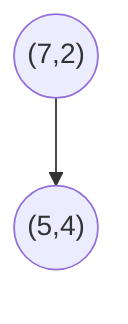
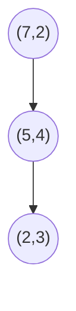
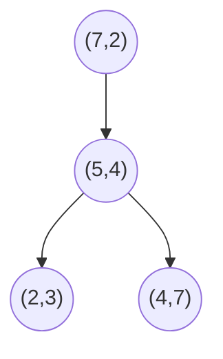
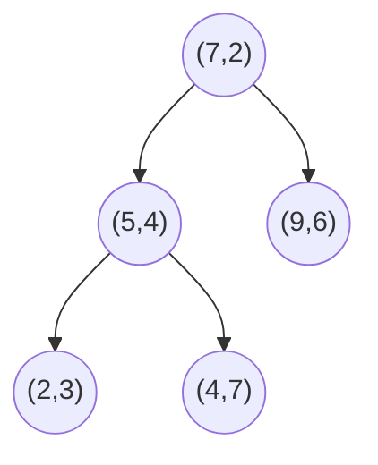
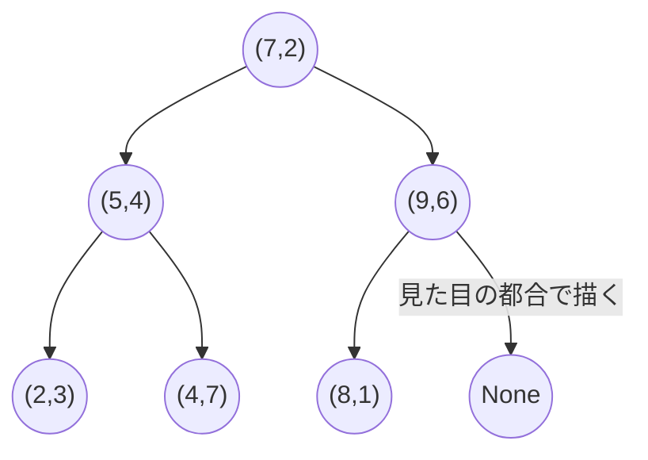

## はじめに
:::message alert
記事内容は筆者の勉強まとめ内容です。内容の正確さや漏れについては保証できません。
ご覧いただく際は、ご自身で判断のうえ参考にしてください。
:::

## 概要
- シラバス：E資格2024#2
- k近傍法とkd-treeを理解します

## キーワード
k近傍法, 近似最近傍, kd-tree

## 学習内容
#### k近傍法（k-Nearest Neighbors, k-NN）
- 教師あり学習のアルゴリズムの一つです。このアルゴリズムは、入力データに基づいて最も類似した「近隣」のデータポイントを見つけ、分類や予測を行います

**手順**
1. 訓練データセットの準備：ラベル付きの訓練データを用意します。各データポイントには、特徴と対応するラベル（分類問題の場合）や数値（回帰問題の場合）があります
2. 距離計算：新しいデータ点（テストデータ）に対して、そのデータ点と訓練データにある各データ点との距離を計算します。通常はユークリッド距離やマンハッタン距離などが使われます
3. 近傍の選定: 計算した距離に基づき、最も近いk個のデータ点を選びます。この「k」がアルゴリズムのパラメータです
4. 多数決でデータを予測します
    - ラベルの決定（分類の場合）: k個の近隣データ点の中で、最も頻繁に現れるラベルを選んで、そのラベルをテストデータの予測ラベルとして使用します
    - 予測値の算出（回帰の場合）: k個の近隣データ点のラベルの平均をとり、その値をテストデータの予測値とします

:::message
左上k=1の画像を見て、座標約(4.8,2.5)の赤点と(7.1,3.2)の緑点を注目します
k=1なので、周りのデータを一つしか見えないので、ノイズのようなエリアが作りやすいです
k=1の場合、テストデータがこの2点の赤/緑の小さい範囲にいると、赤/緑に分類されます

*出典：Tzu-Chi Lin, Visualize the result based on different K, Day 3 — K-Nearest Neighbors and Bias–Variance Tradeoff(2018), https://medium.com/30-days-of-machine-learning/day-3-k-nearest-neighbors-and-bias-variance-tradeoff-75f84d515bdb*

:::

### 近似最近傍（ANN）
- k近傍法は近隣のデータで分類や予測を行う手法です
- しかし、データ量が多くと予測処理が重くなるので、それを改善する手法の一つは近似最近傍という手法です
- ある程度の誤差を許容し、精度を設定して、周りのK個データを使ってK近傍法で予測します
    - 精度100%の条件では元のK近傍法です
    - 精度100%ではない場合、取得したデータは必ず一番近いK個のデータではないですが、取得したデータはその正解データかなり近いことが保証できます
    - 完全に最も近い”わけではないが、誤差の範囲で十分近い点という意味です
- 近似最近傍を使わない時に、厳密最近傍と呼ばれます

例えば、周りの100万データからK=10000のK近傍法を使うと、計算量が多いです
ただ、近似最近傍の手法を使うと、その唯一の正解データではなく、近似なデータを使って同じ結果を予測することも可能です

### kd-tree
- 多次元ののユークリッド空間における“点”を分類・検索するための二分木です
- 最近傍探索の高速化などの用途で用いられます

#### kd-treeの構築
> 2次元の例で説明します

- x軸→y軸→x軸→y軸と交互の順序で分割していきます
    - どちらの軸から分割しても良いです
    - 各軸の値の中央値を基に分割することが一般的には多い

*出典：Yasen Hu, KD-Tree(2019), https://yasenh.github.io/post/kd-tree/*

こちらの画像を例で説明します

1. 一回目の分割：x座標は2,4,5,7,8,9、ここは中央に近い値7の座標(7,2)を選択します
2. 二回目の分割：1で分割された左部分のデータを見て、y座標は3,4,7があって、ここは(5,4)を選択します
3. 三回目の分割：2で分割された下の部分を見て、x座標は2しかないので、(2.3)を選択します
4. 四回目の分割：2で分割された上の部分を見て、x座標は4しかないので、(4.7)を選択します
5. 五回目の分割：1で分割された右の部分を見て、y座標は6,1があって、ここで(9,6)を選択します
6. 六回目の分割：5で分割された下の部分を見て、x座標は8しかないので、(8,1)を選択します

:::message
手順4と5の部分、xがｙどっちを見る話ですが、このエリアが分割されたときに、どの座標を見て分割されたことを見ます。
例えば、手順4は手順2で分割されたエリアで、手順2はyで分割することなので、手順4はx座標を見ます。
同じく、手順5は手順1で分割されたエリアで、手順1はxで分割することなので、手順5はy座標を見ます。

ややこしいと思いましたら、毎回分割する時に、全エリアに対して分割しましょうか

手順2以下の内容は下のように変更します
2. Y座標を見て、左部分は(5,4)を選択して、右部分は(9,6)を選択します
3. x座標を見て、左上の部分は(4,7)、左下(2,3)、右上はなし、右下は(1,8)を選択します
4. もしまたデータ（点）が残していましたら、続きはy座標を見ます
:::

続けて、木を構築します
1. まずrootの(7,2)
2. 次は(5,4)です。
    - 左にいる理由は、手順1で分割されたとき、x=7を選びましたので、x<=7のデータは木の左で、x>7の木の右にします

3. 次は(2,3)です

4. 次は(2,3)です

5. 右の部分、(9,6)です

6. 最後の(8,1)です

**完成図**

*出典：Yasen Hu, KD-Tree(2019), https://yasenh.github.io/post/kd-tree/*

今回構築はx->y->xの順番なので、root(depth=0)はx座標で見つかったデータで、depth=1はy座標で見つかったデータです

#### kd-treeを用いた近傍探索
> データ(6,5)があって、最も近い点を探します

1. まず、第一階層のノードのx座標（木を構築する時にこの階層はx座標で分割するため）を見ます
    - 7>6、木の左部分を見ます
2. 第二階層のノードのy座標をみて、5>4なので、右の部分のエリアにいます
3. 第二階層のノードのx座標を見るべきですが、下にはもノードがありません。ということは手順2で分類されたエリアに、(4,7)はこのエリアの唯一なデータです。ここで(4,7)を最適解候補にします
    - ユークリッド距離は$\sqrt{8}$なので、この時点の最小距離を$\sqrt{8}$とします
4. しかしながら、これが最小距離とは限らないため、後は木を上に遡って、存在するノードとの距離を計算します
5. 続けて、遡って(5,4)のy座標を見ます。y座標距離は1((2,3)と(5,4))です。1は$\sqrt{8}$より小さいため、最適解が(5,4)で分割された下のエリアに存在する可能性があります。よって、このエリアのデータも最適解候補としまして、最適解候補は(4,7),(5,4),(2,3)となります。ここでユークリッド距離を計算して、現時点の最適解が更新されました。ユークリッド距離が$\sqrt{2}$の(5,4)です

*出典：Yasen Hu, KD-Tree(2019), https://yasenh.github.io/post/kd-tree/ より編集した*

6. 5と同じ、遡って(7,2)のx座標を見ます。x座標距離は2でして、現時点の最短距離より大きい数値です。よって、(7,2)の右のエリアに現時点より優れる最適解が存在しません。
7. もうルートに到達して、かつ木の左部分の最適解が見つかって、右の部分は最適解が存在しない事がわかりましたので、データ(6,5)の最も近い点は(5,4)です