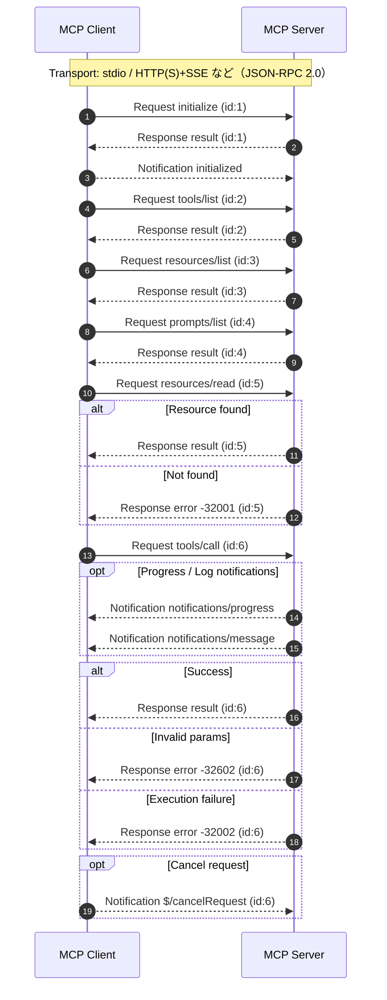

# はじめに

MCPの勉強を始めて、本の内容を実際に動かしてみました。

勉強している本 (MCP入門――生成AIアプリ本格開発、小野 哲 (著))
https://www.amazon.co.jp/MCP%E5%85%A5%E9%96%80%E2%80%95%E2%80%95%E7%94%9F%E6%88%90AI%E3%82%A2%E3%83%97%E3%83%AA%E6%9C%AC%E6%A0%BC%E9%96%8B%E7%99%BA-%E5%B0%8F%E9%87%8E-%E5%93%B2/dp/4297152959

# CH03実装時の注意点
1. 設定完了後、必ず`[ファイル]→[終了]`でClaude Desktopを終了します
2. Claude Desktopを再起動した後、`[ファイル]→[設定]→[開発者]`でcaculator MCPサーバーの設定を適用したかを確認します


3. プロンプトで確認することもできます


4. MCPサーバーを使用された結果です


:::message
本記事執筆時点でのClaude Desktopバージョンは、1.1.4498 (24f768)です
:::

# JSON-RPC
「JSONで定義された、シンプルなRPCプロトコル」であり、特に内部APIや双方向通信（WebSocket）で強みを発揮するプロトコルです

### RPC（Remote Procedure Call）
別プロセス／別サーバ上の関数を、あたかもローカル関数のように呼び出す仕組みです

下の例のように、ネットワーク越しに実行するイメージです
■サーバー

```
function calculate(int num1)

end function

calculate(10)
```

■クライアント

```
remoteServer.calculate(10)
```

## 特徴
| 項目      | 内容                                      |
| ------- | --------------------------------------- |
| データ形式   | JSON                                    |
| トランスポート | HTTP / HTTPS / TCP / WebSocket 等（規定しない） |
| 状態      | ステートレス                                  |
| 軽量性     | XML-RPCより軽量                             |
| バージョン   | 1.0 / 2.0（主流は2.0）                       |

:::message
HTTP必須ではありません。JSON形式のメッセージ仕様を定義しているだけです
:::

## データ構造
### リクエスト
```
{
  "jsonrpc": "2.0",
  "id": 1,
  "method": "tools/list",
  "params": {}
}
```

| フィールド   | 必須 | 説明                  |
| ------- | -- | ------------------- |
| jsonrpc | 必須 | バージョン、このルールで話す意味     |
| method  | 必須 | 呼び出すメソッド名           |
| params  | 任意 | 引数（配列 or オブジェクト）    |
| id      | 必須 | リクエスト識別子（レスポンスと紐付け） |


### レスポンス

**■成功時**
```
{
  "jsonrpc": "2.0",
  "id": 1,
  "result": { "tools": [] }
}
```

**■失敗時**
```
{
  "jsonrpc": "2.0",
  "id": 1,
  "error": { "code": -32601, "message": "Method not found" }
}
```

| フィールド   | 説明       |
| ------- | -------- |
| code    | エラーコード   |
| message | エラー概要    |
| data    | 詳細情報（任意） |

### 通知（Notification）
- idを省略すると通知になります　→　レスポンスは返らない
- 用途：
    - ログ送信
    - 非同期イベント通知
    - メトリクス送信

```
{
  "jsonrpc": "2.0",
  "method": "notifications/message",
  "params": { "level": "info", "message": "hello" }
}
```
## MCPでよく使うメソッド
### 初期化フェーズ
- セッション確立

| メソッド          | 方向              | 種別           | 概要                       | 主な params                                       | 主な result                    |
| ------------- | --------------- | ------------ | ------------------------ | ----------------------------------------------- | ---------------------------- |
| `initialize`  | Client → Server | Request      | セッション初期化。プロトコルバージョン・能力交渉 | `protocolVersion`, `capabilities`, `clientInfo` | `serverInfo`, `capabilities` |
| `initialized` | Client → Server | Notification | 初期化完了通知                  | なし                                              | なし                           |

### Tools
- アクション実行

| メソッド         | 方向              | 種別      | 概要           | 主な params           | 主な result                                   |
| ------------ | --------------- | ------- | ------------ | ------------------- | ------------------------------------------- |
| `tools/list` | Client → Server | Request | 利用可能なツール一覧取得 | なし                  | `tools[]`（name, description, inputSchema 等） |
| `tools/call` | Client → Server | Request | ツール実行        | `name`, `arguments` | `content`（実行結果）                             |

### Resources
- データ取得

| メソッド             | 方向              | 種別      | 概要            | 主な params | 主な result                            |
| ---------------- | --------------- | ------- | ------------- | --------- | ------------------------------------ |
| `resources/list` | Client → Server | Request | 利用可能なリソース一覧取得 | なし        | `resources[]`（uri, name, mimeType 等） |
| `resources/read` | Client → Server | Request | 指定URIの内容取得    | `uri`     | `contents[]`（text / blob 等）          |

### Prompts
- テンプレ取得

| メソッド           | 方向              | 種別      | 概要             | 主な params           | 主な result                        |
| -------------- | --------------- | ------- | -------------- | ------------------- | -------------------------------- |
| `prompts/list` | Client → Server | Request | 利用可能なプロンプト一覧取得 | なし                  | `prompts[]`（name, description 等） |
| `prompts/get`  | Client → Server | Request | テンプレート取得       | `name`, `arguments` | `messages[]`                     |

### 通知
- 非同期通知

| メソッド                     | 方向              | 種別           | 概要           |
| ------------------------ | --------------- | ------------ | ------------ |
| `notifications/message`  | Server → Client | Notification | ログ／情報メッセージ通知 |
| `notifications/progress` | Server → Client | Notification | 進捗通知         |
| `notifications/error`    | Server → Client | Notification | 非致命エラー通知     |

## エラーコード
### JSON-RPC標準エラー
| Code     | 名称               | 意味           | 典型原因              |
| -------- | ---------------- | ------------ | ----------------- |
| `-32700` | Parse error      | JSON構文エラー    | 不正JSON            |
| `-32600` | Invalid Request  | JSON-RPC形式不正 | `jsonrpc`欠落等      |
| `-32601` | Method not found | メソッド未定義      | `tools/list`未実装など |
| `-32602` | Invalid params   | パラメータ不正      | 引数の型が違う     |
| `-32603` | Internal error   | サーバ内部例外      | 未処理例外             |

### MCP実装でよく使われるアプリケーションエラー
- 慣習的な設計例です（標準ではない）
- JSON-RPCでは-32000 ～ -32099 はサーバ定義エラー用 として予約されています

| Code     | 意味                       | 典型ケース                  |
| -------- | ------------------------ | ---------------------- |
| `-32000` | Server error（汎用）         | 実行失敗                   |
| `-32001` | Resource not found       | `resources/read`でURI不正 |
| `-32002` | Tool execution failed    | ツール内部例外                |
| `-32003` | Permission denied        | アクセス制御違反               |
| `-32004` | Capability not supported | initialize交渉不一致        |
| `-32005` | Request timeout          | 長時間処理失敗                |

## 通信フロー


| 番号 | 手順                       | 内容（1行要約）                                    |
| -- | ------------------------ | ------------------------------------------- |
| 1,2 | `initialize`             | クライアントとサーバでプロトコルバージョンと能力（capabilities）を交渉する |
| 3 | `initialized`            | クライアントが初期化完了を通知する                           |
| 4,5 | `tools/list`             | 利用可能なツール一覧を取得する                             |
| 6,7 | `resources/list`         | 参照可能なリソース一覧を取得する                            |
| 8,9 | `prompts/list`           | 利用可能なプロンプトテンプレート一覧を取得する                     |
| 10~12 | `resources/read`         | 指定URIのリソース内容を取得する                           |
| 13 | `tools/call`             | 指定ツールを引数付きで実行する                             |
| 14 | `notifications/progress` | サーバが処理進捗を通知する                               |
| 15 | `notifications/message`  | サーバがログや情報メッセージを通知する                         |
| 16 | `Response result`        | リクエストが正常終了し結果を返す                            |
| 17,18 | `Response error`         | リクエストが失敗しエラーを返す                             |
| 19 | `$/cancelRequest`        | クライアントが進行中リクエストのキャンセルを通知する                  |


## メリット
- 実装が容易
- メッセージ構造が単純
- トランスポート非依存
- WebSocketと相性良い

## デメリット
- HTTPセマンティクスを活用できない
- キャッシュ制御が弱い
- API設計の可読性が低くなりやすい
- 標準化された認証仕様は持たない

# MCPの通信方式
- インターネット経由ではHTTPを例にします

| 観点       | STDIO      | HTTP(S)        |
| -------- | ---------- | -------------- |
| 接続形態     | ローカル子プロセス間 | ネットワーク越し       |
| 通信方式     | 標準入力/出力    | HTTP +（多くはSSE） |
| セッション    | プロセス単位で固定  | リクエスト単位／接続単位   |
| 主用途      | ローカル連携     | リモートMCPサーバ     |
| セキュリティ境界 | OSプロセス境界   | TLS/認証境界       |

## アーキテクチャの違い
### STDIO

```
Client (親プロセス)
   └─ spawn
       MCP Server (子プロセス)
          ↑ stdin
          ↓ stdout
```

- 親子プロセス構造
- パイプでJSON-RPCメッセージを送受信
- ネットワークスタックを使わない
- 超低レイテンシ
- 認証不要（同一マシン前提）
- プロセス管理が必要
- クラッシュするとセッション消失

### HTTP(S)

```
Client  →  HTTPS  →  MCP Server
```
- request: POST
- notification: SSE / streaming
- ステートレス設計が基本
- リモート接続可能
- TLSで暗号化
- 認証（APIキー等）可能
- 負荷分散が可能

## 通信モデルの差
| 観点   | STDIO     | HTTP              |
| ---- | --------- | ----------------- |
| 双方向性 | 常時双方向     | 通常は片方向（SSE併用で双方向） |
| 接続持続 | プロセス生存中持続 | 短命 or Keep-Alive  |
| スケール | 単一接続前提    | 複数同時接続可           |
| 再接続  | プロセス再起動   | HTTP再試行           |

:::message
SSE（Server-Sent Events）：HTTPを使ってサーバ → クライアント方向に一方向ストリーミング配信を行う仕組みです
:::

## パフォーマンス特性
| 指標     | STDIO   | HTTP     |
| ------ | ------- | -------- |
| レイテンシ  | 低       | やや高      |
| スループット | 高（ローカル） | ネットワーク依存 |
| 起動コスト  | spawn必要 | 常駐可      |
| 並列性    | 基本1対1   | 水平スケール可  |

## 設計上の違い
| 本質     | STDIO        | HTTP       |
| ------ | ------------ | ---------- |
| 結合度    | 強結合（プロセス依存）  | 疎結合（API境界） |
| 障害影響   | クライアントと運命共同体 | 独立運用可能     |
| DevOps | ローカル管理       | インフラ管理必要   |


## 実務での使い分け
### STDIOが向いているケース
- ローカルIDE連携
- ローカルツール実行
- セキュリティ境界が同一マシン
- 単一ユーザー用途

### HTTPが向いているケース
- クラウドMCPサーバ
- チーム共有
- 負荷分散
- マルチテナント