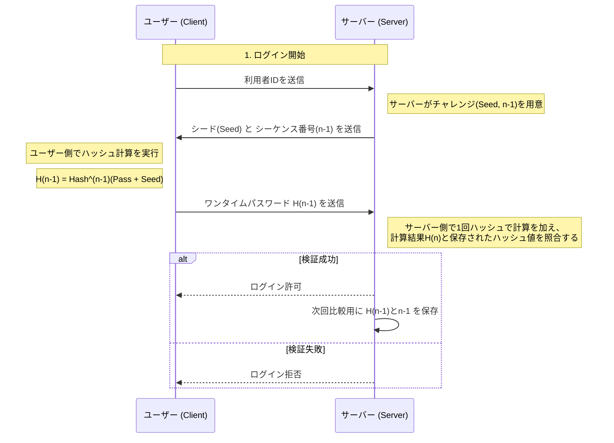
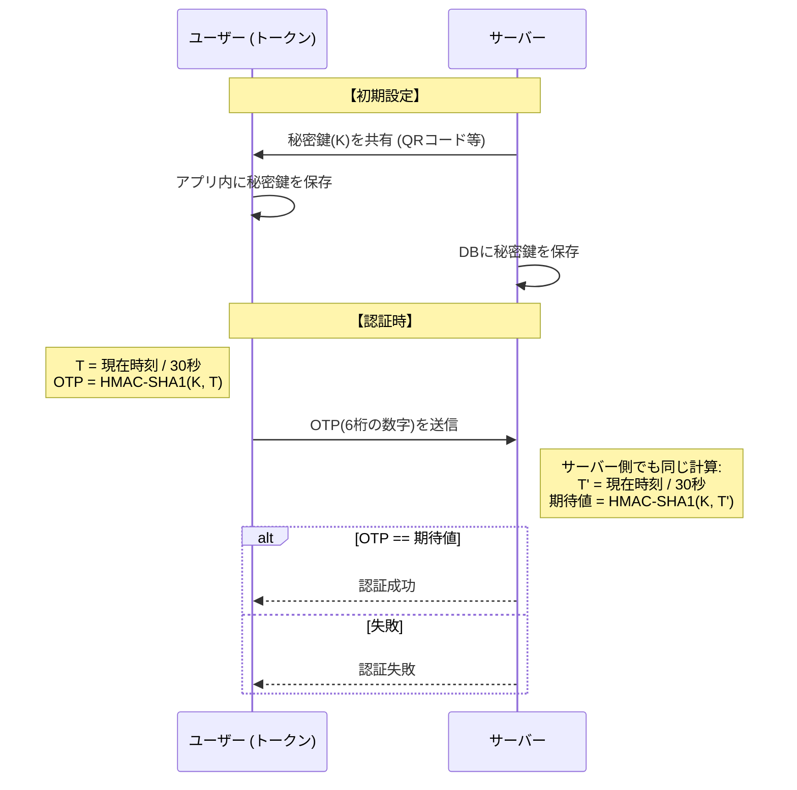
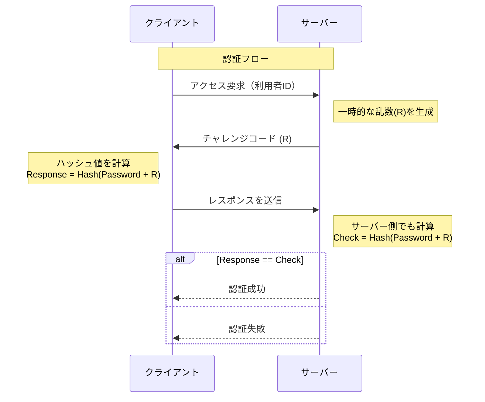

# ワンタイムパスワード（One-Time Password, OTP）
- 一度しか使えない使い捨てのパスワードのことです
- OTPは数秒〜数分で無効になるため、万が一盗み見られても次の瞬間には使えなくなるという強力な特性を持っています
- 主にS/Key方式とタイムスタンプ方式です

# S/Key方式
### 事前準備
- サーバにパスワードを登録します
- シーケンス番号を設定します

### ログイン
- クライアントでidを入力する
- サーバーからseedとシーケンス番号が返さあれる。これらがチャレンジコードとなります
- クライアントが、チャレンジコードとパスワードを用いて、ハッシュ関数を使って計算します　→　OTP完成
- OTPをサーバーに送信します
- サーバーがもう一回ハッシュ関数計算を行って、計算結果と保存した結果を突き合わせます
  - 検証成功：今回認証用のOTP　H(n-1)とシーケンス番号(n-1)を保存して、次回に備えます
  - 検証失敗：ハッシュ値とシーケンス番号共に更新しません

# タイムスタンプ方式（時刻同期方式）
- トークンと呼ばれるパスワード計算機（カード型、ソフトウェア型、キーホルダー型など）を使った方式です
- トークンとサーバーで管理するパスワードを一定時間ごとに変えることによって、毎回異なるパスワードでアクセスを可能にします
- 同期方式は時間を使っています。ある程度のずれが許容されるが、ずれすぎるとアクセスができません
### 事前準備
- 秘密鍵(K)を共有

### 処理流れ

シーケンス図は下記を設定しています

| パラメータ | 設定値 |
| :--- | :--- |
| トークン種類 | アプリ |
| ハッシュ関数 | SHA-1 |
| OTPの桁数 | 6桁 |
| 更新間隔 | 30秒 |
| 生成アルゴリズム | HMAC |

# チャレンジレスポンス
- パスワードそのものをネットワーク上に流さずに、相手が正しいパスワードを知っていることを確認します
- 「サーバーが出したお題（チャレンジ）」に対して、「クライアントが計算した回答（レスポンス）」を返すことで認証を行います

### 認証フロー
- 利用者がidとパスワードをクライアントで入力すると、ユーザーidだけを認証サーバーに送信します
- ユーザーidを受け取ったサーバーは、乱数を生成し、チャレンジコードとしてクライアントへ送信します
- チャレンジコードを受け取ったクライアントは、パスワードとチャレンジコードを基にハッシュ関数でハッシュ値を生成します
- クライアントで生成したハッシュ値をレスポンスとしてサーバーに送信します
- サーバー側は、送信したチャレンジコードと管理しているパスワードでハッシュ値を計算します
- サーバー側は、サーバーが計算したハッシュ値と送られてきたレスポンスを突き合わせてチェックします

:::message
シーケンス図は基本的な認証フローです。適用したプロトコルにより異なる点があります。
:::

