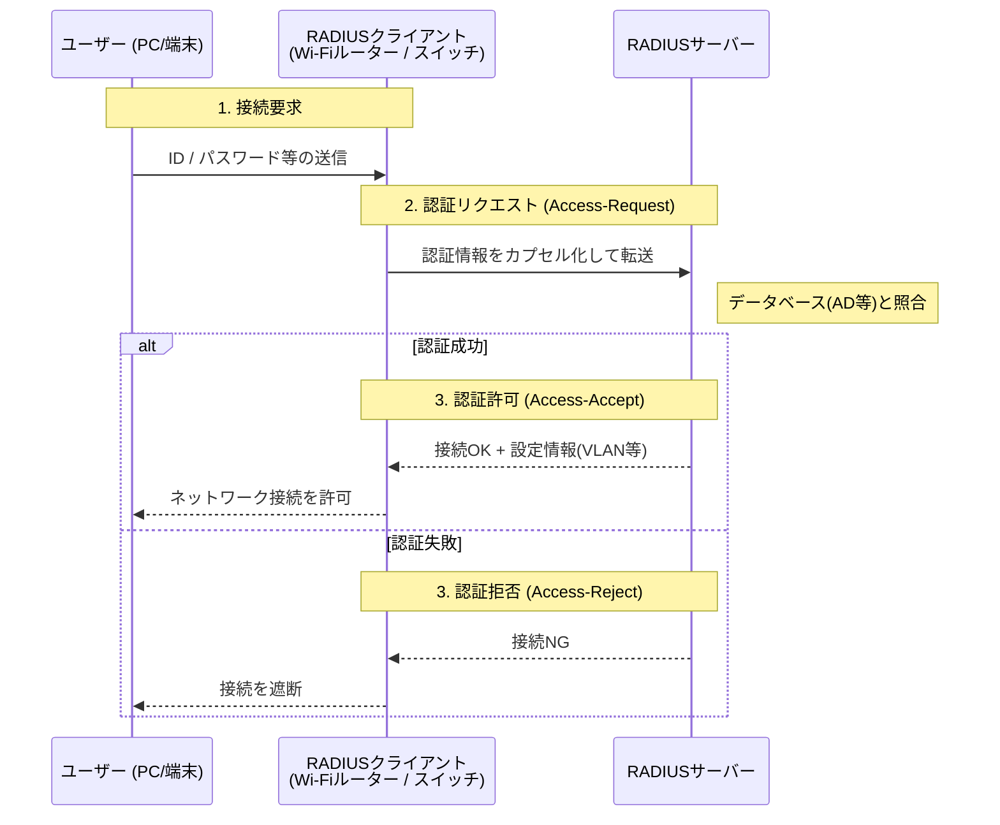
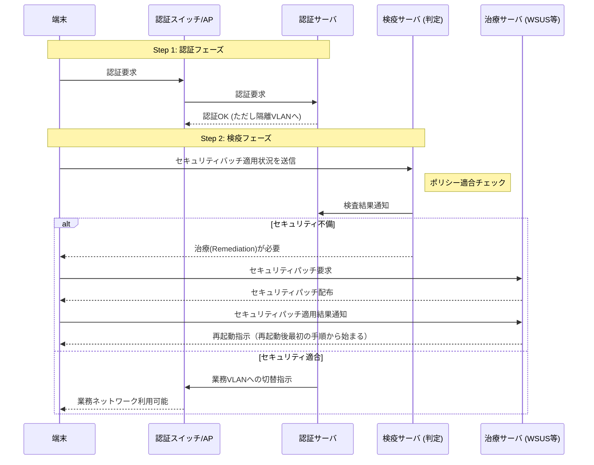
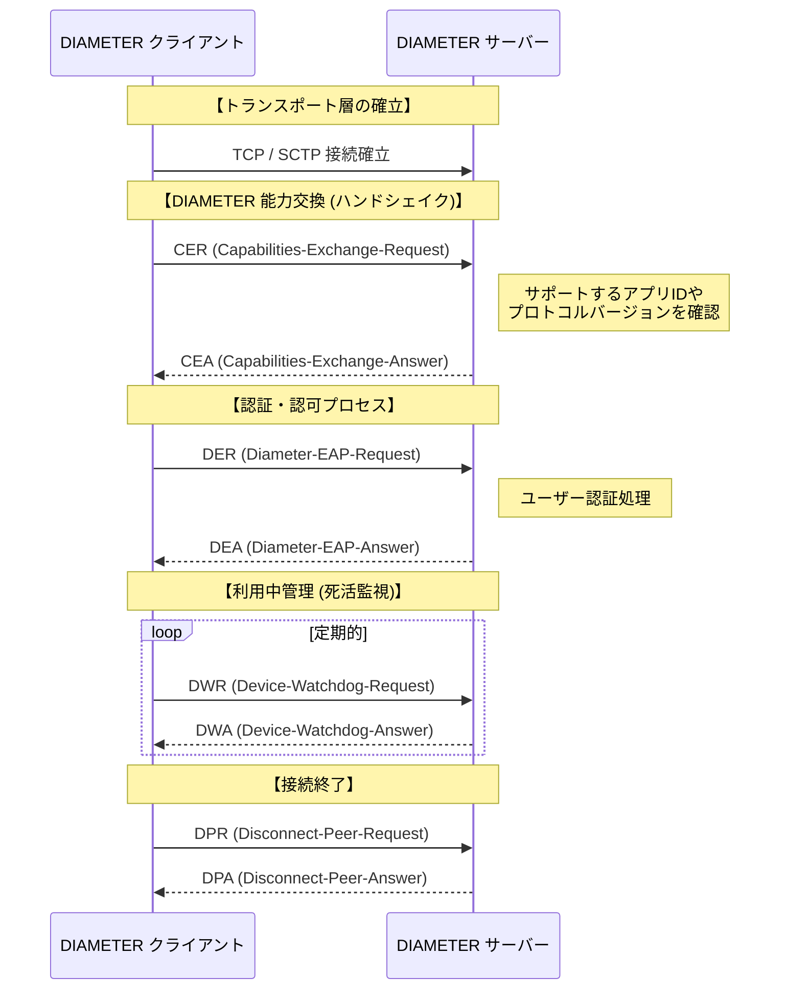

# IEEE 802.1X
ポートベースのネットワークアクセス制御（Port-Based Network Access Control）を規定した標準です。
有線LANや無線LANにおいて、「許可されたユーザーや端末だけをネットワークに接続させる」ための検問（検疫）のような仕組みです。

## 802.1Xの三要素

### サプリカント（Supplicant）
- 認証を要求する側（利用者端末、PC、スマートフォンなど）
- 例：OSに組み込まれた802.1Xクライアント

### オーセンティケータ（Authenticator）

- 認証の仲介を行う装置（スイッチ、無線LANアクセスポイント）
- 認証が完了するまで通信を制限します

### 認証サーバ（Authentication Server）
- 利用者を実際に認証するサーバ
- RADIUSサーバ
- CAサーバ


# EAP（Extensible Authentication Protocol）
- PPPの認証部分を拡張したプロトコルです
- 単独では通信に用いられず、EAPOLやRADIUSなどにカプセル化されて利用される認証用プロトコルです

### 主な認証方式（EAP方式）

| 認証方式 | クライアント認証 | サーバ認証 |
| ------- | --------------- | --------- |
| EAP-TLS | 証明書 | 証明書 |
| PEAP(Protected EAP) | ID／パスワード | 証明書 |
| EAP-TTLS(Tunnel mode TLS) | ID／パスワード | 証明書 |
| EAP-MD5* | ID／パスワード | なし |
| EAP-FAST | ID／パスワード | なし |

- *脆弱性があるため利用は推奨されていません

# EAPOL（EAP over LAN）
- IEEE 802.1Xで規定したEAPメッセージをLAN上でやり取りするためのプロトコルです
- OSI第2層（データリンク層）で動作します
- サプリカントとオーセンティケータ間で使用します
- 認証完了後は通常通信に使われません

```
【端末】──EAPOL──【SW/AP】──RADIUS(EAP)──【認証サーバ】
```
# RADIUS (Remote Authentication Dial-In User Service)
- ネットワーク上のユーザー認証を集中的に行うためのプロトコル、およびその仕組みのことです。
- 「誰が（認証）」「何をしていいか（認可）」「どれくらい使ったか（課金）」というAAAを実現するために広く利用されています。
- 拡張性に限界があり、後継としてDIAMETERが存在します

## 目的
- 利用者認証の集中管理
- 認可（権限付与）の一元化
- 利用状況の記録（アカウンティング）

## 構成要素

| 要素 | 呼び方 | 役割 |
| ---- | ----- | ---- |
| ユーザー | サプリカント | 接続したいPC、スマホ、タブレット。<br/>認証情報（ID/PW,証明書）を提示する主体です。 |
| RADIUSクライアント | オーセンティケータ | スイッチ、無線LANアクセスポイント、VPN装置など。<br/>利用者からの認証要求を中継します。 |
| RADIUSサーバー | 認証サーバー | 認証・認可・記録を行う中核サーバです。<br/>ADやLDAPと連携することが多い |

### 使用されるプロトコル・技術

- UDP
  - 認証／認可：UDP 1812
  - アカウンティング：UDP 1813
- EAP：802.1X認証時の認証方式として利用
- 共有鍵：RADIUSクライアントとサーバ間の通信保護に使用

## 認証の流れ
1. 利用者がネットワーク接続を要求
2. RADIUSクライアントが認証要求をRADIUSサーバへ送信
3. RADIUSサーバが資格情報を検証
4. 認証結果をRADIUSクライアントへ返却
5. 認証成功時のみ通信を許可




# 検疫ネットワーク
セキュリティ要件を満たしていない端末を一時的に隔離し、是正が完了するまで通常ネットワークへの接続を制限するためのネットワークです

## 目的
- マルウェア感染端末の内部侵入防止
- パッチ未適用端末による被害拡大の防止
- 社内ネットワーク全体の安全性維持

## 検疫ネットワークで許可される通信
- 更新サーバ（Windows Update 等）
- ウイルス定義ファイル配布サーバ
- 管理・修復用サーバ
- **業務システムや社内重要サーバへの通信は原則禁止**

## 実装方式
- VLAN分離
- ACL (Access Control List) による通信制御
- ファイアウォールによる分離
- NAC（Network Access Control）製品の利用

## 認証の流れ
1. 端末（サプリカント）がネットワークに接続
2. オーセンティケータは、認証が完了するまで通信を制限
3. EAPOLによる制御
4. サプリカントが認証情報を送信
5. オーセンティケータが認証情報を認証サーバへ転送
6. 認証サーバが認証結果を返却
7. 認証成功時のみ、ポートが開放され通常通信が可能



## 特徴
- 未認証端末のネットワーク接続を防止できる（「接続後に認証」ではなく「接続時点で認証」）
- 利用者単位・端末単位でのアクセス制御が可能
- 有線LAN／無線LANの双方で利用可能
- ゼロトラストや内部不正対策と親和性が高い
- 無線LANの WPA2/WPA3-Enterprise は802.1Xを利用


# DIAMETER
- モバイルネットワーク（4G/5G）や大規模なプロバイダ環境での利用を想定し、RADIUSの弱点を克服するために開発されました
- RADIUSの後継プロトコルです
- RADIUSと同様にAAAフレームワークを実装します

## 目的
- 大量ユーザ環境での認証・課金管理
- ローミングや相互接続を前提としたAAA
- 高い拡張性・信頼性の確保

:::message
**ローミング**：利用者が所属ネットワーク外に移動しても、他ネットワークを経由して継続的にサービスを利用できる仕組みです
:::

## 特徴
- トランスポート層
  - TCP または SCTPを使用
  - 再送制御・順序制御により高信頼（RADIUSはUDP）
- セッション管理
  - セッション識別子を標準で保持
  - 開始・維持・終了を明確に管理可能
- セキュリティ
  - IPsec / TLS による通信保護を前提
  - RADIUSより強固なセキュリティ設計
- 拡張性
  - AVP（Attribute-Value Pair）による柔軟な拡張
  - ベンダ拡張が容易

### RADIUS vs DIAMETER プロトコル特性比較

| 特徴 | RADIUS (Legacy) | DIAMETER (Modern) |
| :--- | :--- | :--- |
| 通信方向 | クライアントからサーバー（単一方向） | 双方向 (P2P) サーバー側から切断要求等が可能 |
| トランスポート | UDP（ポート1812/1813） | TCP / SCTP（ポート3868） |
| セキュリティ | パスワードのみ暗号化（属性は平文） | 全体を暗号化可能 (TLS/IPsec必須) |
| 拡張性 | 属性(Attribute-Value Pair,AVP)の拡張が制限的 | 極めて高い（柔軟なAVP追加が可能） |
| 通信方向 | クライアントからサーバー（単一方向） | 双方向 (P2P) サーバー側から切断要求等が可能 |
| 主な用途 | 企業Wi-Fi、VPN、LAN認証 | LTE/5G（EPC/IMS）、大規模課金システム |


## 処理の流れ

### 接続確立（ピア接続）
1. DIAMETERクライアントとDIAMETERサーバがTCP または SCTP で接続
2. Capability Exchange（CER / CEA）を相互確認
3. 相互に処理可能であることを確認

### 認証・認可（Authentication / Authorization）
1. クライアントが 認証・認可要求（AA-Request） を送信
2. 要求メッセージにAVPを付与
3. サーバが資格情報を検証
4. 認証・認可応答（AA-Answer） を返却
    - 成功／失敗
    - 利用可能なサービス・制限条件

### 利用中管理（Accounting / Session Management）
- セッション開始時：Accounting-Request（START）
- 利用中：Accounting-Request（INTERIM）
- セッション終了時：Accounting-Request（STOP）
- 各要求に対し Accounting-Answer を返却
- セッションIDにより一連の処理を一意に管理

### 接続終了
1. 利用終了や切断検知
2. 課金・利用記録を確定
3. セッション情報を解放


:::message

| ステップ | 説明 |
| :--- |  :--- |
| **CER / CEA** | 互いに「どの機能（LTE認証か、課金か等）」が使えるか事前に確認します。RADIUSにはこの手順はありません。 |
| **DER / DEA** | 認証の中身（EAP）を運ぶためのリクエスト（DER）とレスポンス（DEA）のセットです。 |
| **DWR / DWA** | 常に「生きてる？」と確認し合います。片方が落ちた際のフェイルオーバーが高速です。 |
| **DPR / DPA** | 正常に通信を終了させる手続きです。 |

:::

