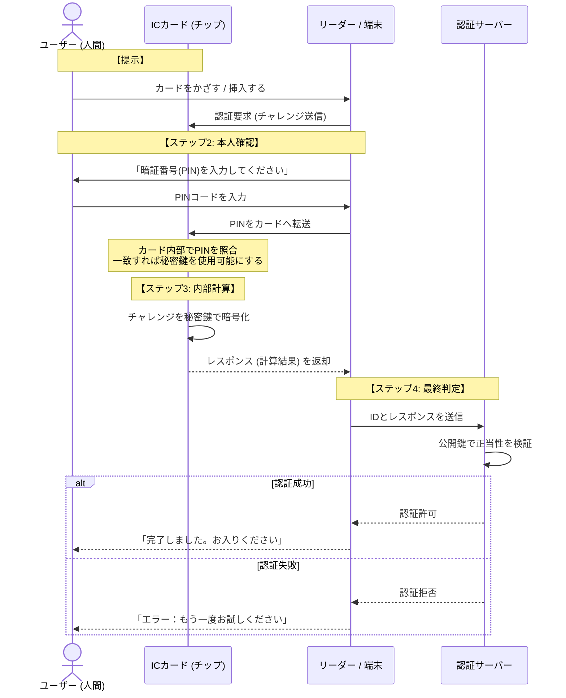

# ICカードによる認証
- ICカードに格納された秘密情報を用いて本人確認を行う所持情報に基づく認証方式です
- 主に所持情報による認証として位置付けられるが、多くの場合、ICカード単体ではなくPIN（知識情報）と併用するため、二要素認証になります



## 脅威とセキュリティ要件
| 脅威 | セキュリティ要件 | 機能 |
| --- | ------- | --- |
| ICカードの不正利用 | ICカードが、正当な使用権限を持ったもの以外のものに使用されないこと | PINによる所有者本人確認 |
| 偽造ICカードの利用 | 正規ICカードだけが使用できること | 端末がICカードを認証する（内部認証） |
| 内容の不正読み出しや不正書き込み | ICカード内部の情報が不正に読みだされたり、<br/>改ざんされたりしないこと | ICカードが端末を認証する（外部認証） |
| 盗聴による情報漏洩 | リーダとICカードの間の通信が傍受されても、内容が分からないこと | 暗号化 |

## 耐タンパ性
- ICカード内部に格納された秘密情報（鍵・証明書・個人情報など）を、不正な解析・改ざん・抽出から保護する能力を指します
- ICカードの「信頼の根（Root of Trust）」を担保します

### 主な耐タンパ技術
- 物理的対策
  - チップ表面の保護層（メッシュ配線）
  - 不正開封検知によるデータ消去
  - 微細加工による解析困難化
- 電気的対策
  - 異常電圧・異常クロック検知
  - 不正動作検出時の処理停止
  - グリッチ攻撃対策
- 論理的対策
  - 認証回数制限（PIN入力回数制限）
  - 不正検知時のカードロック
  - セキュアOSによるアクセス制御
- 暗号的対策
  - 秘密鍵を外部に出さず、カード内部で暗号演算
  - チャレンジレスポンス方式
  - 公開鍵暗号・電子署名の利用

:::message
**グリッチ攻撃**:瞬間的な電圧やクロックの異常を与えて装置を誤動作させ、不正処理や情報漏えいを狙う攻撃です。
例えば、一瞬の電圧低下／上昇、クロックの一時的なずれなど
:::

## PIN(Personal Identification Number)
- カード使用者が正当な利用者であることを証明するために、ICカードを使用する時に入力する番号（文字列）のことです
- 一般的に、一定回数の失敗でロックするように設定します

### ロックの解除
- 管理者が新たに鍵ペアを生成します（再発行）
- 管理者がICカードを回収し、管理者用のパスワード（管理者PIN）で利用者PINを初期化します
- 解除用コマンドを用意して、利用者を確認して利用者に伝えます

## 端末ーICカード間の相互認証
- 内部認証：端末（端末側ミドルウェアなど）が、ICカードを認証します。偽造ICカードなど不正なICカードの使用を防止します。
- 外部認証：ICカードが端末を認証します。不正なプルグラムがICカードの内部の情報を読み出したり、改ざんしたりすることへの対策です

## ICカード内のファイル構造

```
MF（Master File）
 ├─ DF（社員証アプリ）
 │   ├─ EF（個人識別番号）
 │   └─ EF（氏名データ）
 └─ DF（食堂決済アプリ
     ├─ EF（プリペイド残高）
     └─ EF（取引履歴）
```

### 各ファイルの役割
- MF（Master File）
  - ICカード内の最上位ディレクトリ
  - ファイルシステムのルートに相当
  - カード全体の管理情報を保持
- DF（Dedicated File）
  - アプリケーション単位や機能単位のディレクトリ
  - 複数のEFをまとめる役割
  - DFの配下にDFを持つことも可能
- EF（Elementary File）
  - 実際のデータを格納するファイル
  - 認証情報、証明書、個人情報などを保持
  - アプリケーションから直接参照・更新される

## セキュリティとアクセス権
ICカードのファイル構造がPCと決定的に違うのは、「ファイルごとに詳細なアクセス権限（AC：Access Condition）が設定されている」点です

- 読み取り制限: PIN（暗証番号）を入力しないと読み取れないEF。
- 書き換え制限: 認証サーバーのみが書き換え可能で、ユーザーは見るだけのEF。
- 非公開: 秘密鍵のように、外部からは一切読み取ることができない特殊な領域。

### 典型的な設定例
- EF（秘密鍵格納）
  - READ：禁止（Never）
  - UPDATE：管理者のみ
  - CRYPTO（署名）：利用者PIN認証後
- EF（公開鍵証明書）
  - READ：Always
  - UPDATE：管理者のみ
- 利用履歴EF
  - READ：PIN認証後
  - UPDATE：アプリケーションのみ

### セキュリティ設計上のポイント
- 最小権限の原則を徹底
- 秘密情報は「参照不可・処理のみ可」
- 管理系操作は必ず管理者認証を要求


# 生体認証（バイオメトリクス認証）
指紋や顔などの個人固有の生体情報を用いて本人確認を行う認証方式です

## 評価指標
- 正常認識
  - 本人受入率：本人を本人と正しく認識する確率
  - 他人拒否率：他人を他人と正しく認識する確率
- 異常認識（エラー）
  - FAR（他人受入率）：他人を誤って本人と認証する確率
  - FRR（本人拒否率）：本人を誤って拒否する確率

:::message
一般的に、多少本人拒否率を高くなったとしても、他人受入率が十分低くなるように設定されます。
本人拒否率の高さは、運用面で他の方法と併用することでカーバできます
:::

## 注意点
- 漏えいしても変更できない
- 環境や体調の影響を受けやすい
- 完全一致ではなく確率的判定