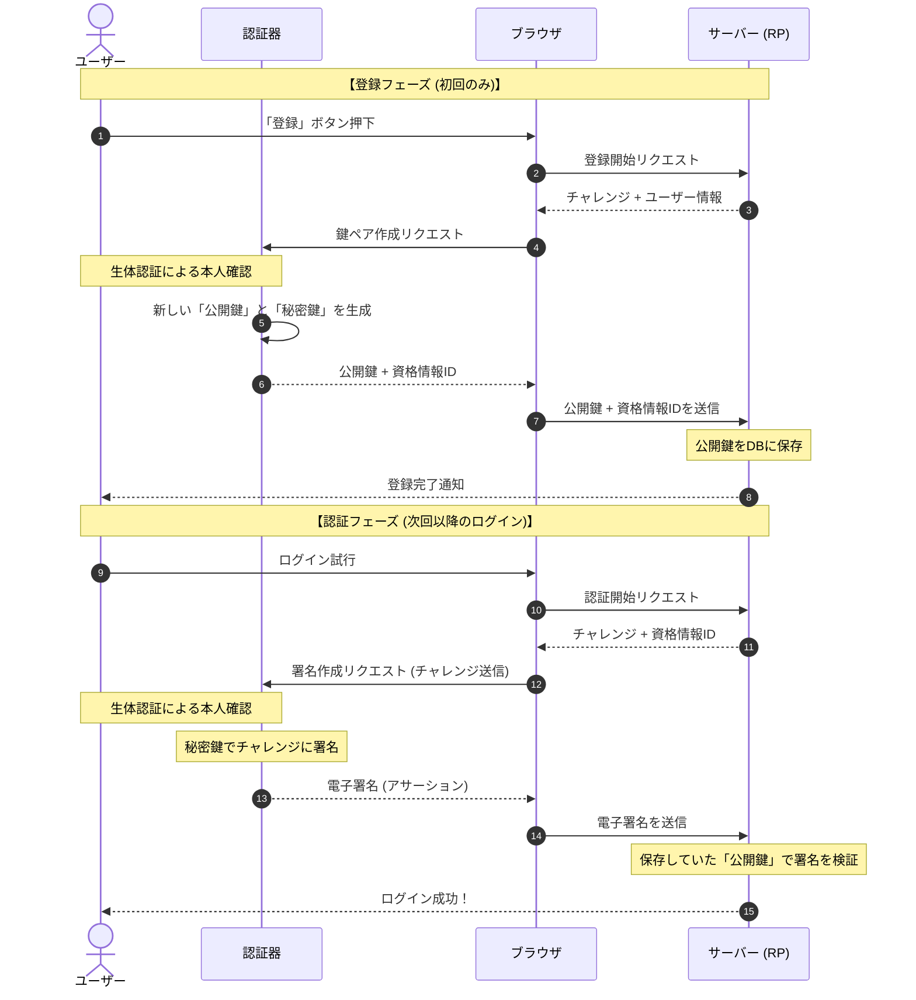
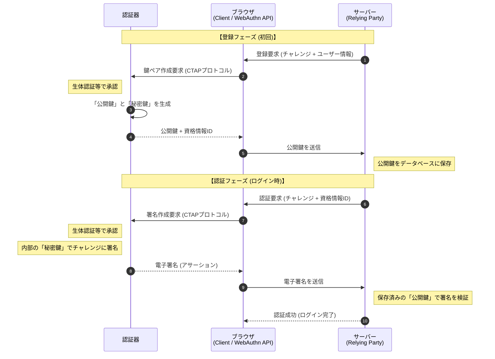

# FIDO（Fast IDentity Online）認証
パスワードに依存せず、公開鍵暗号を用いて本人認証を行う認証方式であり、
フィッシング耐性と利便性の両立を目的とした国際標準です。

| 区分        | 世代       | 位置付け            |
| --------- | -------- | --------------- |
| **UAF**   | 第1世代     | パスワードレス認証 <br/>主にモバイルアプリ向け<br/>生体認証やPINでローカル解除      |
| **U2F**   | 第1世代     | パスワード＋第2要素<br/>USB／NFCキーを使用<br/>Webログインのセキュリティ強化が目的      |
| **FIDO2** | 第2世代（現行） | UAFとU2Fを統合・発展<br/>WebAuthn（Web標準API）<br/> CTAP（端末―認証器間プロトコル） |

## FIDO2
FIDO2は、次の2要素で構成されます
- WebAuthn：Webサービス ⇔ ブラウザ間のAPI（W3C標準）
- CTAP：ブラウザ ⇔ 認証器間の通信プロトコル（FIDO Alliance標準）

```
Webサービス
   ↑ WebAuthn
ブラウザ
   ↑ CTAP
認証器（セキュリティキー・内蔵生体認証 等）
```

### 比較
| 観点   | WebAuthn | CTAP          |
| ---- | -------- | ------------- |
| 規格主体 | W3C      | FIDO Alliance |
| 通信相手 | Webサービス  | 認証器           |
| 役割   | API      | 通信プロトコル       |


## WebAuthn（Web Authentication）
- Webブラウザ上で公開鍵暗号を用いたFIDO認証を実現するためのW3C標準APIです
- Webアプリ(Relying Party)とブラウザ間の標準APIです
- 認証器との直接通信は行われません→ ブラウザが仲介します

```
利用者 ─ ブラウザ ─ WebAuthn ─ 認証器
```

### 基本的な流れ

**登録（Registration）**
- Webサービスが登録要求を送信します
- ブラウザが認証器に鍵生成を要求します
- 公開鍵をWebサービスに登録します

**認証（Authentication）**
- Webサービスがチャレンジを送信します
- 認証器が秘密鍵で署名します
- 公開鍵で検証します



:::message
ユーザー: ブラウザ（PC/スマホ）を操作する人です。
認証器 (Authenticator): 指紋リーダー、顔認証（Face ID/Windows Hello）など。
ブラウザ (Client): ChromeやSafariなど、WebAuthn APIを仲介する役割です。
RP (Relying Party): ログインしようとしているWebサイト（サーバー）。
:::

### セキュリティ上の特長
- パスワード不要
- 秘密鍵は認証器外に出ません（生体情報の漏洩リスクが低下する）
- オリジン束縛によるフィッシング耐性（ブラウザが「ドメイン（URL）」を確認するため、偽サイトでは署名が作れない）
- リプレイ攻撃耐性
- 中間者攻撃耐性

## CTAP（Client to Authenticator Protocol）
FIDO2においてブラウザと認証器間の通信を担うプロトコルです

### セキュリティ上の特長
- 秘密鍵は常に認証器内に保持します
- ブラウザ経由でも鍵は漏えいしません
- 認証器の真正性確認を実施します

### 基本的な流れ

