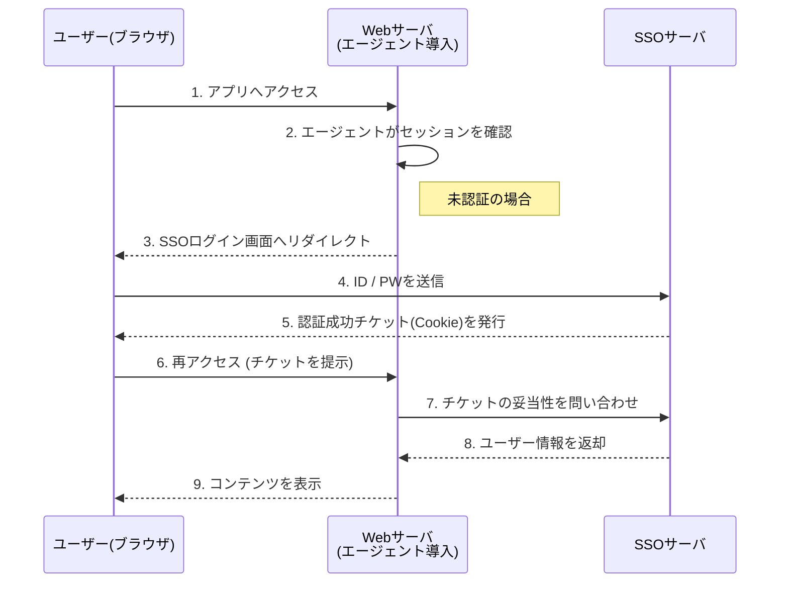
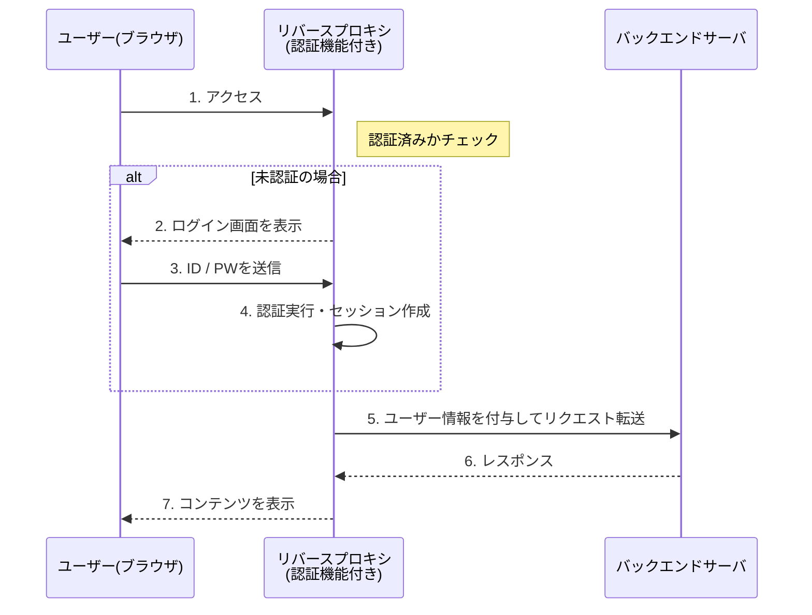
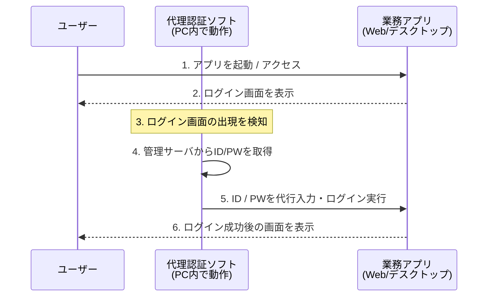

# シングルサインオン(SSO)
一度の利用者認証で、複数のシステムやサービスを追加の認証なしに利用できる仕組みです

### SSOの基本概念
- 初回ログイン時に認証を実施します
- 認証状態（セッション）を他システムが信頼して利用します
- 同一利用者であることを各システムが再認証せずに確認します

### 目的
- 認証回数の削減による利便性向上します
- パスワード管理の集中化にします
- 認証ポリシーの統一します
- 利用者ID管理負荷の軽減します

### 代表的な実装方式
| 実装方式 | 説明 |
| --- | --- |
| エージェント方式 | 各サーバにSSO用エージェントを導入 認証情報をエージェントが仲介 |
| リバースプロキシ方式 | バックエンドは認証済み通信のみを受け入れ |
| 代理認証方式 | フロントで認証し、バックエンドへ認証結果を引き渡す |
| Kerberos方式 | チケットベースの認証 Windowsドメイン環境で広く利用 |
| IDフェデレーション方式 | SAML認証方式 OAuth2.0による連携 OIDCによる認証・連携方式 |

### セキュリティ上の注意点
- 認証基盤が単一障害点になります
- 認証突破時の影響範囲が大きくになります
- 強固な認証（MFA）との併用が前提です

# エージェント方式、リバースプロキシ方式、代理認証方式

| 観点       | エージェント方式     | リバースプロキシ方式 | 代理認証方式     |
| -------- | ------------ | ---------- | ---------- |
| 認証処理の場所  | 各サーバ上のエージェント | フロントのプロキシ  | フロントの認証サーバ |
| 追加導入箇所   | 各業務サーバ       | プロキシのみ     | 認証基盤       |
| アプリ改修    | 原則不要         | 不要         | 必要な場合あり    |
| 単一障害点    | 分散           | プロキシ       | 認証サーバ      |
| 主な利用環境   | オンプレ         | Webシステム    | アプリ連携型     |

## エージェント方式
- 各業務サーバにSSOエージェントを組み込みます
- エージェントが認証基盤と連携します
- サーバごとに攻撃面が増加します

## リバースプロキシ方式

- 利用者と業務サーバの間にリバースプロキシを配置します
- 認証はプロキシで一元処理します
- 認証済み通信のみバックエンドへ転送します
- プロキシに各種役割を持たせて、単一障害点になりやすいです

## 代理認証方式
- フロントの認証サーバが利用者を認証します
- 認証結果をバックエンドに引き渡します
- バックエンドは代理された認証結果を信頼します
- トークン管理が重要です

