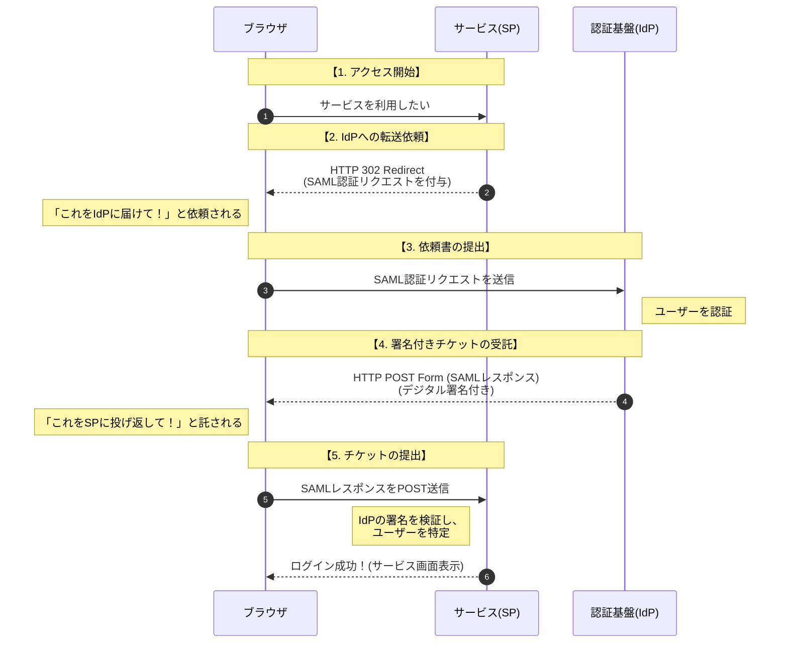
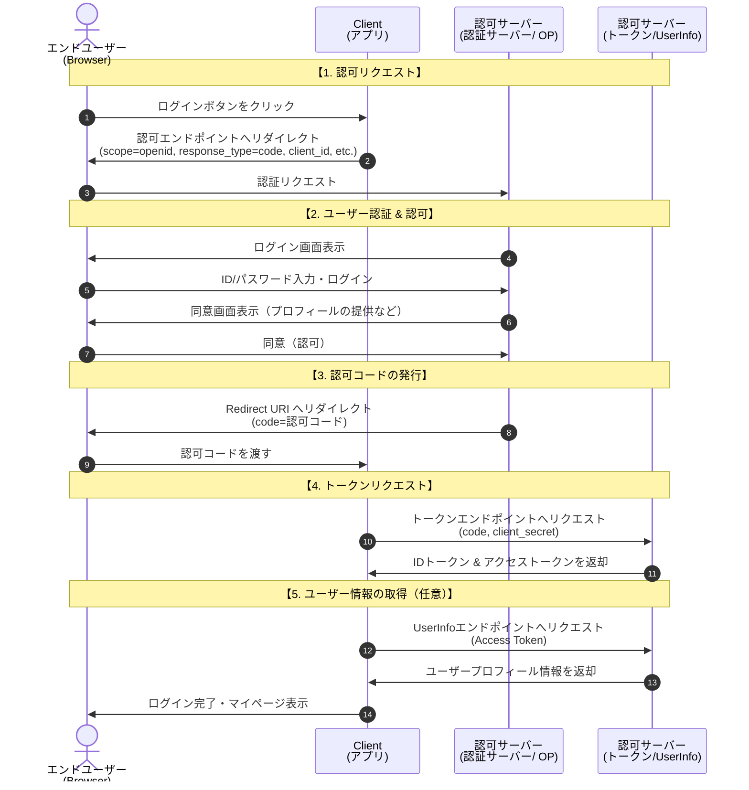

# SAML認証（Security Assertion Markup Language 認証）

- 異なるシステム・組織間で、認証結果を安全に連携するためのフェデレーション認証方式です。
- シングルサインオンの一種です
- 認証そのものを委譲し、認証結果だけを連携するための**XMLベース**の標準仕様です。

## 仕組み
1. 利用者がSPにアクセス
2. SPがIdPへ認証を委譲
3. IdPが利用者を認証
4. IdPが SAML Assertion（認証結果） を発行
5. SPがAssertionを検証
6. SPでセッション確立

| 用語 | 正式名称 | 役割 |
| --- | -------- | ---- |
| IdP | Identity Provider | 認証を行い、認証結果を発行する |
| SP | Service Provider | 認証結果を信頼してサービスを提供する |
| アサーション | Assertion | IdPが発行する「認証済みであることの証明書」 |

:::message
アサーションに含まれる主な情報：利用者識別子、認証時刻、有効期限、属性情報（任意）、電子署名（改ざん防止）
:::

# OIDC (OpenID Connect)
OAuth 2.0 に「認証機能」を追加した仕様です
## 仕組み

### ロール
End User：利用者
Client：アプリケーション
OpenID Provider（OP）：認証サーバ

### 処理の仕組み
1. 利用者がClientにアクセス
2. ClientがOPへ認証要求
3. OPが利用者を認証
4. 認可コード発行
5. Clientがコードをトークンと交換
6. IDトークン取得
7. Clientでログイン確立

## トークン
### 主なトークン
| トークン       | 役割         |
| ---------- | ---------- |
| IDトークン     | 認証結果（本人確認） |
| アクセストークン   | APIアクセス    |
| リフレッシュトークン | 再取得用       |

### IDトークン
- JWT形式
- 含まれる情報：利用者識別子（sub）、認証時刻（auth_time）、発行者（iss）、対象クライアント（aud）、有効期限（exp）
- 署名付き（改ざん防止） 