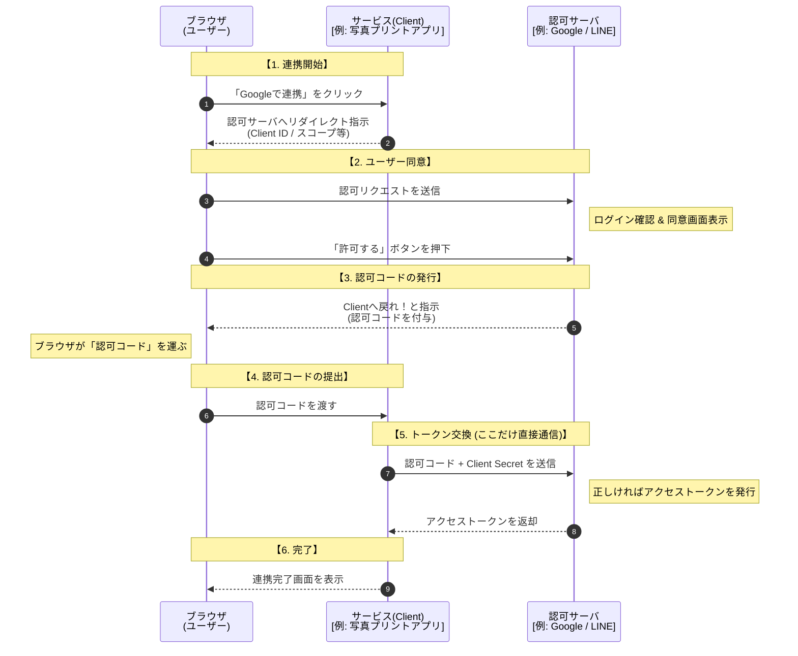
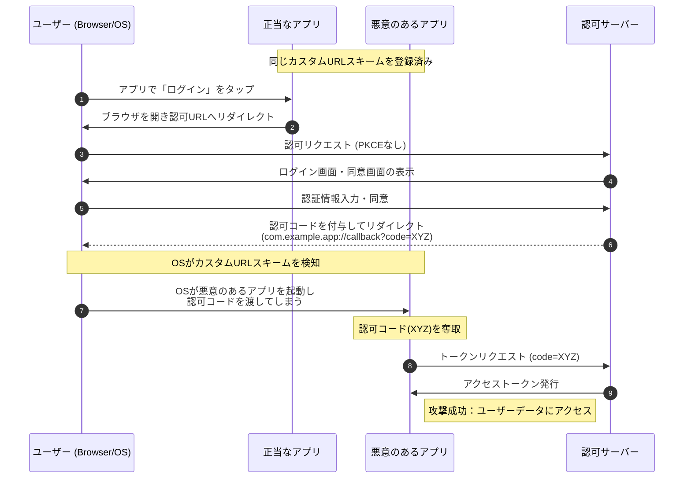
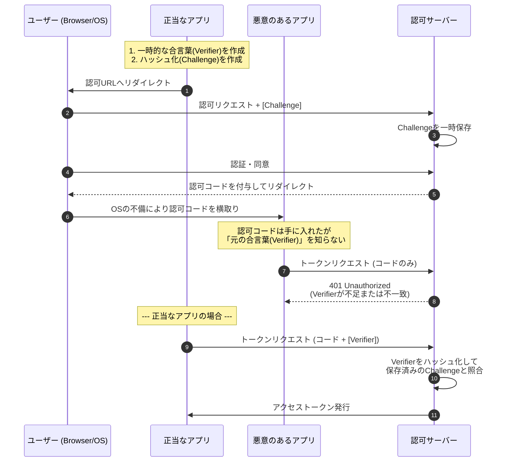
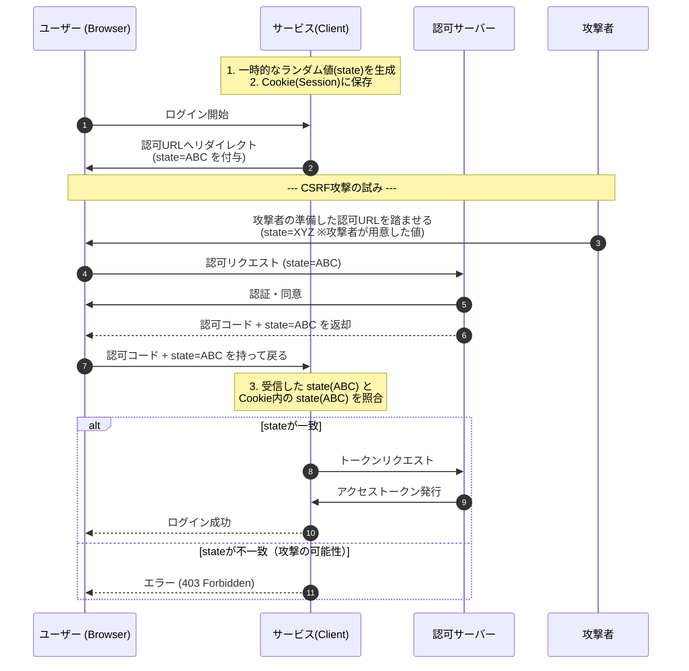

# OAuth

OAuthは、第三者アプリに対して利用者の権限を安全に委譲するための認可プロトコルであり、認証は行わいません。

:::message
現在のOauthは基本的にOAuth2.0を指します。OAuth 1.0はほぼ廃止の状態になります。
:::

:::message
利用者識別が必要な場合は OpenID Connectを使います
:::

## 仕組み
- 典型的な利用例はソーシャルログインです

| 役割                   | 説明           |
| -------------------- | ------------ |
| Resource Owner       | 利用者、ユーザー      |
| Client               | 権限を使いたいアプリ   |
| Authorization Server | 認可を行いトークンを発行 |
| Resource Server      | APIやデータを提供   |

> 下のシーケンス図は、Authorization ServerとResource Serverを同一サーバーになります

## PKCE（Proof Key for Code Exchange）
- OAuth 2.0 の Authorization Code Flow において、認可コード横取り攻撃を防止するための拡張仕様です。
- 認可コードを取得したクライアント本人でなければ、トークン交換できないようにします

### 背景
従来の Authorization Code Flow は、クライアントシークレットを安全に保持できるサーバサイドアプリを前提としていました。
しかし、モバイルアプリやSPA（Single Page Application）のような公開クライアントでは
- クライアントシークレットを安全に保持できない
- 認可コードが盗まれると不正にトークン交換される
という問題がありました

:::message
**認可コード横取攻撃**：盗まれる認可コードを使ってアクセストークンを入手するという攻撃です
:::

### PKCEなしの処理(認可コード横取攻撃)

**説明**
- 事前準備: モバイルOSなどの環境で、攻撃アプリが正当なアプリと同じ「カスタムURLスキーム（例: myapp://）」を登録しておきます。
- 認可コードの露出 (ステップ6-7): 認可サーバーが発行した認可コードは、ブラウザからOSを経由してアプリに届けられます。この際、OSがどちらのアプリに渡すか判断を誤る（または攻撃アプリが優先される）ことで横取りが発生します。
- トークンの取得 (ステップ8-9): PKCEが導入されていない場合、認可コードさえあればトークンへの交換が可能であるため、攻撃者は正当なアプリになりすましてトークンを取得できてしまいます。

### PKCEありの処理

**説明**
- 合言葉の送付: 最初の認可リクエスト（ステップ3）では、生の値（verifier）ではなく、ハッシュ化した値（challenge）のみを認可サーバーに送ります。
- 攻撃者の限界: 攻撃者が認可コードを横取りできても、正当なアプリのメモリ内にある「生の合言葉（verifier）」は盗めません。
- サーバーでの検証: 認可サーバーは、トークン交換時に送られてきた verifier を再度ハッシュ化し、最初に受け取った challenge と一致するか確認します。攻撃者は verifier を知らないため、この検証を突破できません。

## stateパラメータ
- OAuth 2.0／OpenID Connect において、CSRF（Cross-Site Request Forgery）攻撃を防止するために用いられる仕組みです。
- stateは、認可要求と認可応答が「同一セッションに属する正当な要求であること」を確認するための値です
- 「認可リクエストを送った本人（ブラウザ）」と「認可コードを受け取って戻ってきた本人」が同一であることを確認します

### 背景
OAuthでは、

- ブラウザリダイレクトを利用する
- 外部の認可サーバを経由する

という特性上、第三者が用意した認可応答を被害者のブラウザに送りつけるCSRF攻撃が成立します。

**説明**
- クライアント側での準備: 認可リクエストを送る直前に、サーバー（またはブラウザのセッション）側でランダムな文字列 state を生成し、Cookieに紐付けて保存しておきます。
- 認可サーバーの役割: 認可サーバーは、リクエストに含まれていた state を、認可コードと一緒にそのままクライアントへ送り返します。
- 突合チェック: クライアントは、戻ってきた state と、自分が保存しておいた state を比較します。
- 攻撃の遮断: もし攻撃者が自分の state を使ってユーザーに不正な認可フローを踏ませようとしても、ユーザーのCookieに保存されている state とは一致しないため、クライアント側で処理を中断できます。

:::message
stateは推測が不可能なランダムな値である必要があります。
:::

### PKCEとの比較
- 原則的に両方併用が前提です
- PKCEは「認可コードの横取り」を防ぎ、state は「リクエストの偽造（CSRF）」を防ぐという異なる役割を持っています

| 項目   | state      | PKCE                 |
| ---- | ---------- | -------------------- |
| 防ぐ攻撃 | CSRF       | 認可コード横取り             |
| 検証主体 | Client     | Authorization Server |
| 目的   | セッション正当性確認 | コード使用者の正当性確認         |
