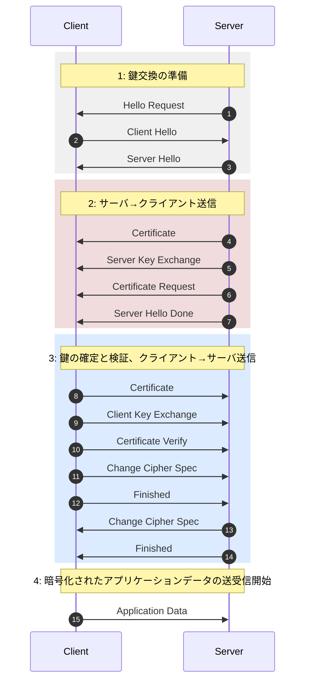
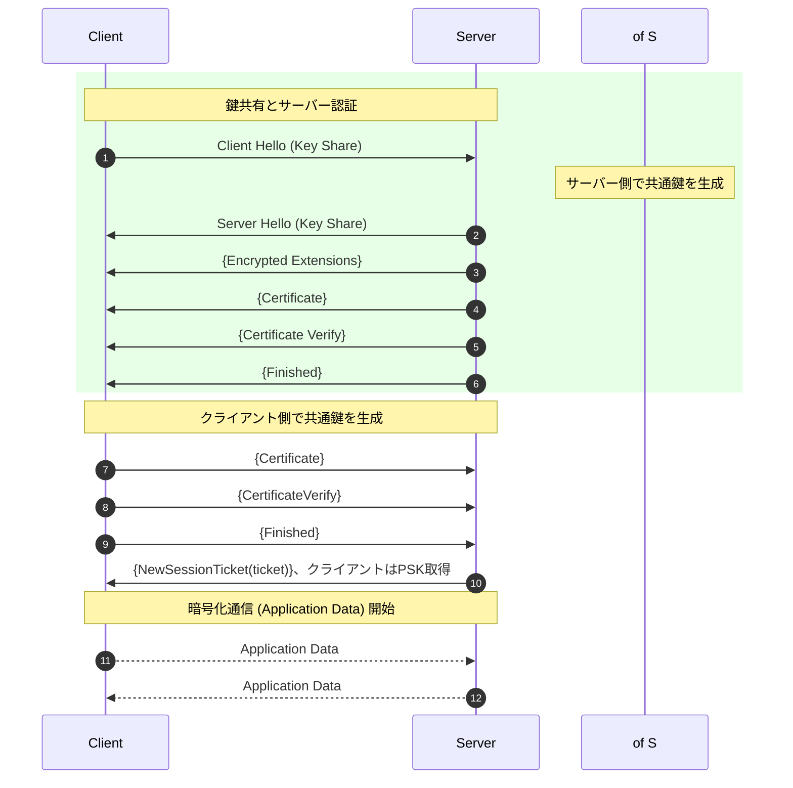

# TLS（Transport Layer Security）
- 通信経路上のデータを暗号化し、盗聴・改ざん・なりすましを防止するためのセキュリティプロトコルです。
- SSLの後継として、現在の安全な通信は事実上TLSに統一されています。
- TLSが提供する3つのセキュリティ特性：機密性、完全性、真正性

### 使用例
- HTTPS（HTTP over TLS）
- SMTP over TLS（STARTTLS）
- IMAPS / POP3S
- VPN（SSL-VPN）
- MQTT over TLS
- CoAP over DTLS（TLSのUDP版）
- REST API（HTTPS）
- gRPC over TLS

## TLS 1.2
- ハンドシェイクで暗号方式と鍵を合意し、その後、共通鍵暗号により安全な通信を行います

### 仕組み



2. クライアントが接続条件を提示します。（例：対応TLSバージョン、クライアント乱数（Client Random）、使用可能な暗号スイート一覧）
3. サーバが条件を確定します（採用するTLSバージョン、サーバ乱数（Server Random）、選択した暗号スイート）
4. サーバ証明書（公開鍵）を送信します
5. [option]サーバ側に証明書がない場合、証明書を必要としない鍵交換方式（PSKや匿名Diffie-Hellman）を選択します
6. [option]クライアント証明書を要求します
7. サーバ送信完了
8. サーバから送られて証明書の正当性を確認します(CA署名、有効期限、FQDN一致)
9. クライアント側は、サーバが贈られた公開鍵で生成したプレマスターシークレットを送信します
10. [option]サーバに要求される場合、クライアント証明書をサーバに送信します
11. [*1] 暗号化通信の開始を宣言します
12. ハンドシェイク内容の完全性検証
13. [*1] 暗号化通信の開始を宣言します
14. ハンドシェイク内容の完全性検証
15. 暗号通信開始

:::message
*1：これは独立したプロトコルで、ハンドシェイクプロトコルには含まれていません。便宜上シーケンス図に説明します
:::

### 鍵交換
方式により処理が異なります。

- RSA方式（旧来）
  - クライアントが Pre-Master Secret を生成
  - サーバ公開鍵で暗号化して送信
- (EC)DHE方式（推奨）
  - Diffie-Hellman による鍵共有
  - 前方秘匿性（PFS）あり


### 共通鍵生成

両者が以下を用いて共通鍵（Master Secret）を生成します。

- Pre-Master Secret
- Client Random
- Server Random

:::message
Pre-Master Secretとは、TLSハンドシェイク中に生成・共有され、最終的な共通鍵を導出するための秘密情報です。
Pre-Masterを作成する段階ではまだ暗号鍵、MAC鍵は生成されていないため、あくまで最終鍵の材料です
:::

### TLS 1.2 暗号スイート構成
```
TLS_ECDHE_RSA_WITH_AES_128_GCM_SHA256
│   │    │        │            │
│   │    │        │            └ ハッシュ
│   │    │        └ 共通鍵暗号
│   │    └ 認証方式
│   └ 鍵交換方式
└ TLSバージョン
```


## TLS 1.3


### 仕組み


:::message
手順3で暗号化が開始します
:::

### TLS 1.3の特徴
- 脆弱なアルゴリズムが削除されました
  - 3DES
  - DSA
  - RC4
  - MD5
  - SHA-1
  - SHA-224
  - AES-CBC
- 共通鍵暗号ChaCha20と署名のEdDSAが追加されました
- 鍵交換はDHE, ECDHE, PSKのみが規定され、ECDHEが必須になりました
- 楕円曲線secp256r1が必須になりました
- ハッシュ関数はSHA-256が必須になりました
- ServerHello以降のハンドシェイクパラメータを暗号化して保護します

## SNI(Server Name Indication)
TLSハンドシェイク時に、クライアントが接続先サーバ名（FQDN）をサーバへ通知する拡張機能です

### 特徴
- ClientHelloに含まれます
- 暗号化される前に送信します
- サーバ証明書送信前に参照されます

```
ClientHello
  └─ SNI拡張で「www.example.com」を送信
        ↓
サーバは該当する証明書を選択
```

### 問題点
- 1つのIPアドレスで複数ドメインを運用したい
- TLSでは証明書を先に送る必要があります
- サーバはどのドメイン用証明書を出すべきか分からないです

### 利用シーン
- バーチャルホスト（1IP・複数ドメイン）
- CDN
- クラウド環境

### セキュリティ上の注意点
TLS 1.2 / 通常の TLS 1.3 では、SNIは暗号化されないので、盗聴によりアクセス先ドメインが推測可能です
対策として、TLS 1.3 拡張のESNI / ECH（Encrypted ClientHello）を利用して、SNIを含む ClientHello を暗号化します

# CDN（Content Delivery Network）
分散配置されたキャッシュサーバを利用し、コンテンツ配信の高速化と可用性向上を図るネットワークです

```
利用者
  ↓
エッジサーバ（CDN）
  ↓（キャッシュ未保持時）
オリジンサーバ
```
- オリジンサーバ：元データを保持
- エッジサーバ：利用者に近い配信拠点

### 主な機能
| 機能     | 内容              |
| ------ | --------------- |
| キャッシュ  | 静的・動的コンテンツを一時保存 |
| 負荷分散   | オリジンへの集中アクセス回避  |
| 高速化    | RTT短縮、帯域節約      |
| 可用性向上  | 障害時の迂回配信        |
| セキュリティ | DDoS緩和、WAF連携    |

### メリット・デメリット
- 利用者のDNS問い合わせに対して、地理情報・負荷状況を考慮した上で、最適なエッジサーバのIPを応答します
- CDNがTLS終端となる場合が多いので、証明書はCDNが管理して、SNIを用いて適切な証明書を選択します
- メリット
  - 応答高速化
  - サーバ負荷軽減
  - 大規模トラフィック耐性
- デメリット
  - キャッシュ更新遅延
  - 設定・コスト増
  - ログ可視性低下

# SSL/TLSの脆弱性

## ダウングレード攻撃
通信相手に本来利用可能な強力なセキュリティ方式を使わせず、意図的に古く弱い方式へ引き下げさせる攻撃です

### 攻撃の仕組み（TLSを例に）
1. クライアントが強力な方式を提示
2. 攻撃者（MITM）が交渉を妨害
3. 弱い暗号方式・旧プロトコルで合意
4. 既知の脆弱性を悪用

### 代表例
- SSL/TLS系
  - SSL 3.0 へ誘導 → POODLE攻撃
  - 脆弱な暗号スイートを強制
- 無線LAN
  - WPA3 → WPA2 へ誘導
- バージョンロールバック攻撃（Version Rollback Attack）：通信交渉に介入し(MITM)、旧バージョンの脆弱なプロトコルを使用させる攻撃です。
- BEAST攻撃（Browser Exploit Against SSL/TLS）：TLS 1.0 / SSL 3.0 の CBC モードの設計上の脆弱性を悪用し、暗号文から平文を推測する攻撃です
- POODLE(Padding Oracle On Downgraded Legacy Encryption)攻撃：SSL 3.0 の設計上の脆弱性を悪用し、暗号化された通信内容を一部復号可能にするダウングレード攻撃の一種です


### 対策
| 対策                | 内容           |
| ----------------- | ------------ |
| 旧方式無効化            | SSL/古いTLSを禁止 |
| 強制バージョン指定         | 最低TLS 1.2以上  |
| HSTS              | HTTPS強制      |
| TLS_FALLBACK_SCSV | 意図的ダウングレード検知 |
| TLS 1.3           | 構造的に耐性あり     |

# HSTS（HTTP Strict Transport Security）
WebサイトがHTTPS通信を強制し、平文HTTPやダウングレード攻撃を防止する仕組みです

### 仕組み
1. 利用者がHTTPSでサイトにアクセス
2. サーバが以下のHTTPレスポンスヘッダを送信：`Strict-Transport-Security: max-age=31536000; includeSubDomains`
3. ブラウザがポリシーを記憶
4. 以降、HTTPアクセスは 自動的にHTTPSへ変換（証明書エラーは無視不可）

| 指定                | 意味          |
| ----------------- | ----------- |
| max-age           | 強制期間（秒）     |
| includeSubDomains | サブドメインも対象   |
| preload           | HSTSプリロード対象 |


### 防げる攻撃
- SSLストリッピング攻撃
- ダウングレード攻撃
- 初回アクセス後の中間者攻撃

:::message
SSLストリッピング攻撃（SSL Stripping Attack）：本来HTTPSで行われるべき通信を、攻撃者が介入してHTTPへ引き下げ、通信内容を盗聴・改ざんする中間者攻撃です
利用者が HTTPからアクセス（初回アクセスが典型）
:::

## プリロードHSTS
HSTSの問題点としては、一回目のアクセスは暗号化されていません。
プリロードHSTSブラウザに事前登録されたHSTS対象サイトに対し、初回アクセス時からHTTPS通信を強制する仕組み

### 仕組み
1. サイト運営者がプリロードリストへ申請
2. ブラウザ（Chrome等）に組み込み
3. 利用者がURL入力
4. HTTPでも自動的にHTTPSへ変換

```
Strict-Transport-Security:
  max-age=31536000;
  includeSubDomains;
  preload
```