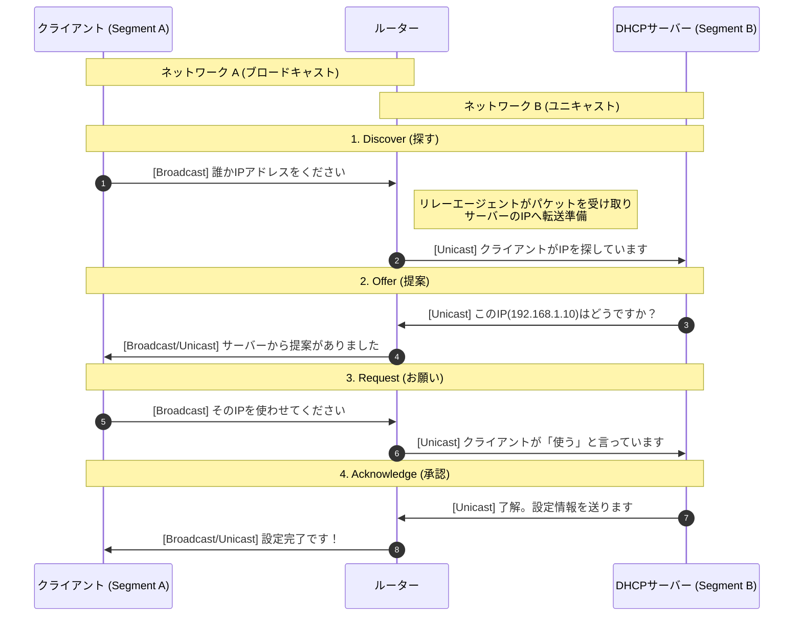

# DHCPサーバー（Dynamic Host Configuration Protocol）
ネットワークに接続してきた端末に対して、通信に必要な「設定セット（IPアドレスなど）」を自動的に配布する役割を担うサーバーです

- IPアドレスの「在庫管理」
    - 貸し出し期間（リース）の管理
    - 予約（固定割り当て）の管理：特定の端末（サーバーやプリンターなど）に対して、常に同じIPアドレスを貸し出す設定も可能です。これは「MACアドレス」を見て判断されます。
- 設定情報の「一括配布」
    - IPアドレス: その端末の識別番号
    - サブネットマスク: ネットワークの境界線
    - デフォルトゲートウェイ: インターネットへの出口（ルーター）の場所
    - DNSサーバー: ドメイン名を解決するための参照先

:::message
小規模運用の場合は、ルータや一部のサーバーがDHCP機能を組み込まれていて、専用サーバー機で運用する必要がありません。
:::

# DHCPサーバセキュリティ

## DHCPスプーフィング（Rogue DHCP攻撃）
- 攻撃者が偽のDHCPサーバをネットワーク内に設置して、正規より早くDHCP応答を返し、クライアントに誤った設定を配布します
    - デフォルトゲートウェイとDNSサーバのIPもリースするため、攻撃者のサーバーに誘導することが可能です
- 意図的に攻撃ではなく、野良DHCPサーバーが邪魔する場合は通信が想定外の箇所に送ることがあります

### 影響
- デフォルトゲートウェイやDNSを攻撃者指定に変更し、中間者攻撃（MITM）やフィッシングが可能になります

## DHCPスタベーション攻撃（DHCP Starvation）
- 攻撃者が大量のDHCP要求を送信して、DHCPサーバのIPアドレスプールを枯渇させる攻撃です
### 影響
- 正規端末がIPアドレスを取得できなくてサービス拒否（DoS）状態になります

## 対策
### DHCPスヌーピング(DHCP snooping)
- L2スイッチがDHCPでやり取りするメッセージの中身をチェックしします。
- L2スイッチで信頼できるポートと信頼できないポートを分けて、信頼できるポートの通信のみ許可します

### ポートセキュリティ
- MACアドレス数制限によるスタベーション対策。
- 1ポートあたりの登録可能MAC数を「1台分」などに制限し、上限超過時は通信遮断・ポート無効化にします

### IP/MACバインディングの監視

- DHCPスヌーピングにより、「IPアドレス、MACアドレス、接続ポート」の対応表（バインディングテーブル）を作成し監視する仕組みです
- スイッチは以下を検証する：
    - そのIPはDHCPで正しく割り当てられたか
    - そのMACは正規ポートに接続されているか

# データベースサーバセキュリティ
DBサーバー自体のセキュリティ問題は、データ管理以外、サーバー自体の管理や運用がセキュリティになることが多いです

## 認証・アカウント管理の問題
- デフォルト／不要アカウントの放置
- 弱いパスワード
- 共用アカウント使用（追跡不能）

### 対策
- 不要アカウント削除
- 強固な認証（多要素認証の導入検討）
- 個別アカウント化とID管理の徹底

## 権限設定の不備（過剰権限）
- アプリがDBA権限で接続
- 不要なUPDATE/DELETE権限付与
- 全テーブル参照可能
- SQLインジェクション時に被害拡大

### 対策
- 最小権限の原則
- ロールベースの権限設計
- 本番と開発の分離

## 通信の未暗号化
- DB接続が平文
- 社内だから安全という誤認
### 対策
- TLSによる通信暗号化
- 証明書の適切な管理

## 保存データの未暗号化
- バックアップ盗難時に即漏えい
- ディスク窃取時に復号不要

### 対策
- TDE（Transparent Data Encryption透過的データ暗号化）：DBの表領域全体を暗号化して、データの書き込みや取り出すときに、自動的に暗号化・復号化する機能です
- バックアップ暗号化
- 鍵管理の分離

## パッチ未適用・脆弱性放置
- 既知脆弱性悪用
- 権限昇格

### 対策
- パッチ管理プロセス
- バージョン管理

## ネットワーク構成不備
- DBサーバを直接インターネット公開
- FW制限なし

### 対策
- アプリケーションサーバ経由のみ接続
- FW・アクセス制御リスト設定

## 監査ログ未取得・未監視
- 不正操作の検知不可
- 事後調査不能

### 対策
- 監査ログ取得
- SIEM連携
- 定期レビュー

:::message
SIEM（Security Information and Event Management）：
複数の機器・システムから出力されるログやイベントを統合的に収集・分析し、セキュリティインシデントを検知・可視化する仕組みです。
:::

## バックアップ管理不備
- 媒体管理不十分
- 復旧テスト未実施

### 対策
- 暗号化保管
- アクセス制限
- 定期復旧訓練