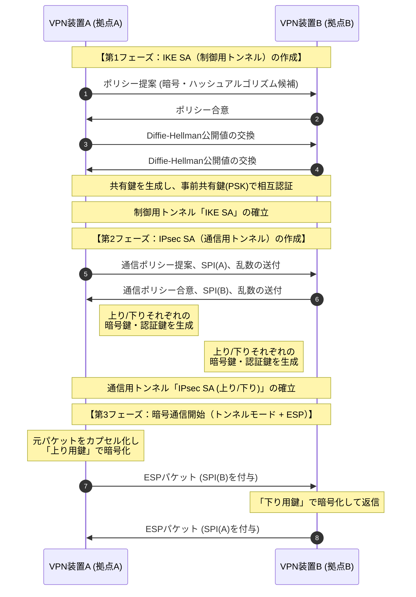

# IPsec（Internet Protocol Security）
- IP通信を暗号化・認証して安全にするネットワーク層のセキュリティ技術です
- IPv6では標準仕様です


## 要素
### プロトコル
IPパケットを保護するプロトコル群で、以下の二つの主要プロトコルを使います

| プロトコル                               | 役割                                |
| ----------------------------------- | --------------------------------- |
| AH（Authentication Header）           | 完全性と認証。パケットが改ざんされていないかを確認。暗号化はなし。 |
| ESP（Encapsulating Security Payload） | 暗号化＋認証。データ機密性と改ざん防止を両立。           |


### 通信モード
| モード        | 概要                    | 用途         |
| ---------- | --------------------- | ---------- |
| トランスポートモード | IPヘッダはそのまま、ペイロードのみ暗号化 | セキュアなホスト間通信     |
| トンネルモード    | パケット全体を新しいIPヘッダでカプセル化するため、透過的で安全。現在の主流 | VPNゲートウェイ間 |


### 認証モード

| モード        | 概要        |
| ---------- | --------------- |
| メインモード | 相互認証に固定IPを使う |
| アグレッシブモード  | 動的IPアドレスも認証可能 |

**トランスポートモードの暗号化**
- 元のIPヘッダが一番外側にあるため、パケットの最終目的地（端末）が経路上のルーターに見えています
- 元のIPヘッダを再利用し、データ部分のみを保護します

```
[ 元のIPヘッダ ] [ ESPヘッダ ] <--- ここから暗号化 ---> [ TCP/UDP ] [ データ ] [ ESPトレーラ ] <--- ここまで ---> [ ESP認証 ]

```

**トンネルモードの暗号化**
- パケット全体を丸ごと包み込み、新しいIPヘッダを付与します
- 「元のIPヘッダ」ごと暗号化されているのが最大の特徴です。外側からは、VPN装置（ルーター）間の通信にしか見えません
- VPN装置が外側に自装置（vpnクライアントまたはルーター）と対向装置（向こうのVPN装置）のグローバルIPを記した「新しいIPヘッダ」を貼り付けます
    - 復号は対向のVPN装置で復号します

```
[ 新IPヘッダ ] [ ESPヘッダ ] <--- ここから暗号化 ---> [ 元のIPヘッダ ] [ TCP/UDP ] [ データ ] [ ESPトレーラ ] <--- ここまで ---> [ ESP認証 ]
```

## 仕組み

**トンネルモード+ESP**



### 第１フェーズ：IKE SA（制御用トンネル）作成
- 相互認証には事前共有器を使って、両方のVPN装置に設定しておきます
- 第１、２フェーズで使用する暗号アルゴリズムとハッシュアルゴリズムを決定し、その鍵をDiffie-Hellman方式で共有します
- 作成したトンネルがIKE SAです

:::message
IKE SA: Internet Key Exchange Security Association。または、ISAKMP SA
:::

### 第２フェーズ：IPsec SA（通信用トンネル）二つ作成
- IPsec SAを上り用と下り用を作成します
- データ通信時（第３フェーズ）の暗号アルゴリズムと認証アルゴリズムを決定し、双方のSPI値、乱数を交換します
- その後、上り通信用の暗号鍵と認証鍵、下り通信用の暗号鍵と認証鍵をそれぞれ作成します

:::message
SPI（Security Parameters Index）：IPsecで通信を識別・管理するための識別子で、IPsec SAを区別するための値です。
:::

### 第３フェーズ：暗号通信開始
- 第２フェーズで決めた暗号アルゴリズム、認証アルゴリズムと第２フェーズで作成した暗号鍵、認証鍵を使って暗号通信を開始します